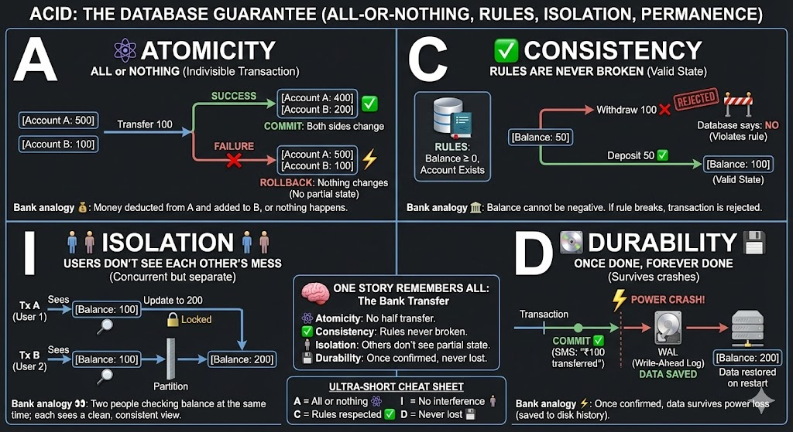

# Databases & Storage — A Practical Wiki for Engineers
## Why Databases Use Disk + Filesystem (and Not Object Storage)

This wiki explains **how databases store data**, **what guarantees they need**, and **why certain storage types are chosen** in real systems.

---

## 1. One Universal Truth

> All data eventually lives as blocks on physical disks (SSD or HDD).

Cloud storage types differ in:
- who manages the filesystem
- what guarantees are exposed
- latency vs durability trade-offs

---

## 2. What a Database Needs

A production database requires:
- low latency
- small random reads/writes
- crash safety
- concurrency control

These are provided by filesystem semantics.

---

## 3. Filesystem Guarantees

### fsync (Durability)
Forces data from memory to disk so commits survive crashes.

### Atomic Writes
Writes are all-or-nothing, never half-written.

### Locking
Prevents concurrent writes from corrupting data.

---

## 4. ACID Explained

| Property | Meaning | Backed by |
|--------|---------|-----------|
| Atomicity | All or nothing | Atomic writes |
| Consistency | Rules preserved | Constraints |
| Isolation | No interference | Locks / MVCC |
| Durability | Data survives crash | fsync + WAL |

---

## 5. WAL (Write-Ahead Logging)

```
Transaction
  ↓
Write WAL
  ↓
fsync WAL
  ↓
Apply data
  ↓
Commit
```

---

## 6. Storage Types

### Block Storage
Examples: AWS EBS, Azure Managed Disk

Low latency, filesystem required, best for live DBs.

### File Storage (NFS)
Shared, higher latency, risky for DBs.

### Object Storage
Examples: S3, Azure Blob

API-based, no filesystem semantics, for backups only.

---

## 7. Latency Comparison

| Storage | Latency |
|--------|---------|
| Local SSD | microseconds |
| Block Disk | ~1 ms |
| NFS | few ms |
| Object Storage | 10–100 ms |

---

## 8. When to Use What

| Use Case | Storage |
|--------|---------|
| Live DB | Block |
| Backups | Object |
| Shared files | File |

---

## 9. Summary

Databases use block storage because they need filesystem guarantees to provide ACID.
