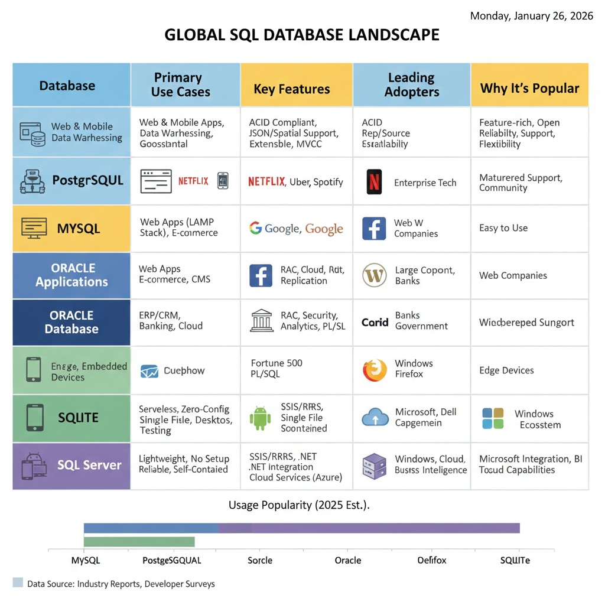

# Databases from First Principles  
## A Wiki-Style Guide for Platform & DevOps Engineers

This wiki explains **why databases exist, why SQL exists, and why engines like MySQL and PostgreSQL exist**,  
using simple language, real examples, diagrams, and control-plane analogies.

It is written for **deep understanding and interview readiness**, not memorization.

---

## 1. Reality at the Bottom: Disk Blocks

At the lowest level, computers only have **disk blocks**.

```
[Block][Block][Block][Block]
```

Disk blocks:
- Store raw bytes
- Have no structure
- Have no names
- Have no safety or coordination

Humans cannot work directly with disk blocks.

---

## 2. What the Filesystem Solved

The filesystem is an **OS-level abstraction** on top of disk blocks.

```
file.txt
   |
 inode
   |
[Block 12][Block 45][Block 78]
```

### Filesystem responsibilities
- File & directory names
- Grouping blocks into files
- Persistence across reboots
- Permissions & ownership

### Filesystem guarantees
> “Your bytes will be stored safely.”

### Filesystem does NOT solve
- Concurrent writes
- Data correctness
- Querying
- Relationships

---

## 3. Why Filesystems Failed: The Overwrite Problem

Example file:

```
balance.txt
Ravi=1000
```

Two programs run at the same time:

- Program A: reads 1000 → adds 500 → writes 1500
- Program B: reads 1000 → subtracts 200 → writes 800

Final result:
```
Ravi=800   ❌
```

Correct result:
```
Ravi=1300
```

Filesystem stores bytes, not **intent**.

This is the **first reason databases were created**.

---

## 4. What a Database Really Is

A database is **a long-running program (process)** whose job is to manage shared data safely.

Architecture change:

```
Applications → DATABASE PROCESS → Filesystem → Disk
```

Golden rule:
> Applications never touch data files directly.

---

## 5. What Databases Solved

Databases introduced:

### Centralized access
- Single gatekeeper
- Ordered writes
- No lost updates

### Organized storage
- Tables
- Rows and columns
- Data types

### Relationships
- Reference data instead of duplication

### Indexes
- Separate structures for fast lookup

### Crash recovery (WAL)
- Write intent first
- Undo / redo after crash

Databases solved **correctness, safety, and sharing**.

---

## 6. What Databases Did NOT Solve

Even with databases:
- Data was stored correctly
- Indexes existed
- Relations existed

But humans still had **no easy way to ask questions**.

Developers had to write **procedural programs**.

---

## 7. Life Without SQL (Procedural Querying)

Stored data:

Customers:
```
id | name
1  | Ravi
2  | Amit
```

Orders:
```
order_id | customer_id | amount
101      | 1           | 500
102      | 1           | 300
```

Question:
> “Show me Ravi’s orders”

Procedural approach:

```
open customers
loop customers
  if name == "Ravi"
    save id

open orders
loop orders
  if customer_id == saved id
    print order
```

Problems:
- Every question = new code
- Everyone writes logic differently
- Performance tuning is manual
- Code breaks as data grows

---

## 8. Why a Query Language Was Needed

Humans think in **questions**:
> “What data do I want?”

Without SQL, computers force:
> “How do I loop through data?”

A query language separates:
- **Intent (WHAT)**
- **Execution (HOW)**

---

## 9. SQL: Declarative Querying

Same question in SQL:

```sql
SELECT orders.order_id, orders.amount
FROM customers, orders
WHERE customers.id = orders.customer_id
  AND customers.name = 'Ravi';
```

Meaning:
- Describe result
- Database decides steps

Internal flow:

```
SQL Query
   ↓
Query Planner
   ↓
Execution Plan
   ↓
Data
```

---

## 10. Indexes + SQL

Indexes existed before SQL.

Difference:

Without SQL:
- Humans choose indexes manually
- Humans plan loops

With SQL:
- Database chooses indexes
- Database plans execution

Indexes help machines.  
SQL helps humans.

---

## 11. SQL Is a Declarative Control Plane

SQL behaves like modern control planes.

### Terraform

```
HCL → Terraform Engine → Cloud APIs → Infra
```

### Kubernetes

```
YAML → K8s Control Plane → Pods
```

### Databases

```
SQL → DB Engine → Filesystem → Disk
```

Same pattern. Different domain.

---

## 12. What Are MySQL and PostgreSQL?

SQL is **just a language**.

MySQL and PostgreSQL are **database engines** that:
- Parse SQL
- Plan queries
- Manage storage
- Handle concurrency
- Recover from crashes

They are **control planes for data**.

---

## 13. Why Multiple Engines Exist

SQL is a standard.
Implementations differ.

Different engines optimize for:
- Simplicity
- Correctness
- Performance
- Extensibility

Just like:
- Different Kubernetes distros
- Different container runtimes

---

## 14. Why MySQL Became Popular

- Very easy to install
- Fast for simple queries
- LAMP stack adoption
- Low operational overhead

Perfect for early web applications.

---

## 15. Why PostgreSQL Is Preferred Today

PostgreSQL prioritizes:
- Strong correctness
- SQL standards compliance
- Advanced queries
- Extensibility (JSONB, extensions)

As systems became complex, correctness mattered more than simplicity.

---

## 16. MySQL vs PostgreSQL Summary

| Area | MySQL | PostgreSQL |
|----|------|-----------|
| Philosophy | Simplicity | Correctness |
| Defaults | Flexible | Strict |
| Features | Fewer | More |
| Extensibility | Lower | Higher |
| Best for | Simple apps | Long-lived systems |

---

## 17. Final Mental Model

```
Human Intent
   ↓
Declarative Language (SQL)
   ↓
Database Engine (MySQL / PostgreSQL)
   ↓
Filesystem
   ↓
Disk Blocks
```

Each layer solves a **different problem**.

---

## 18. One-Sentence Summary (Memorize)

Databases solved safe and shared data storage, while SQL solved the human problem of querying data declaratively, and engines like MySQL and PostgreSQL exist to execute SQL correctly at scale.

