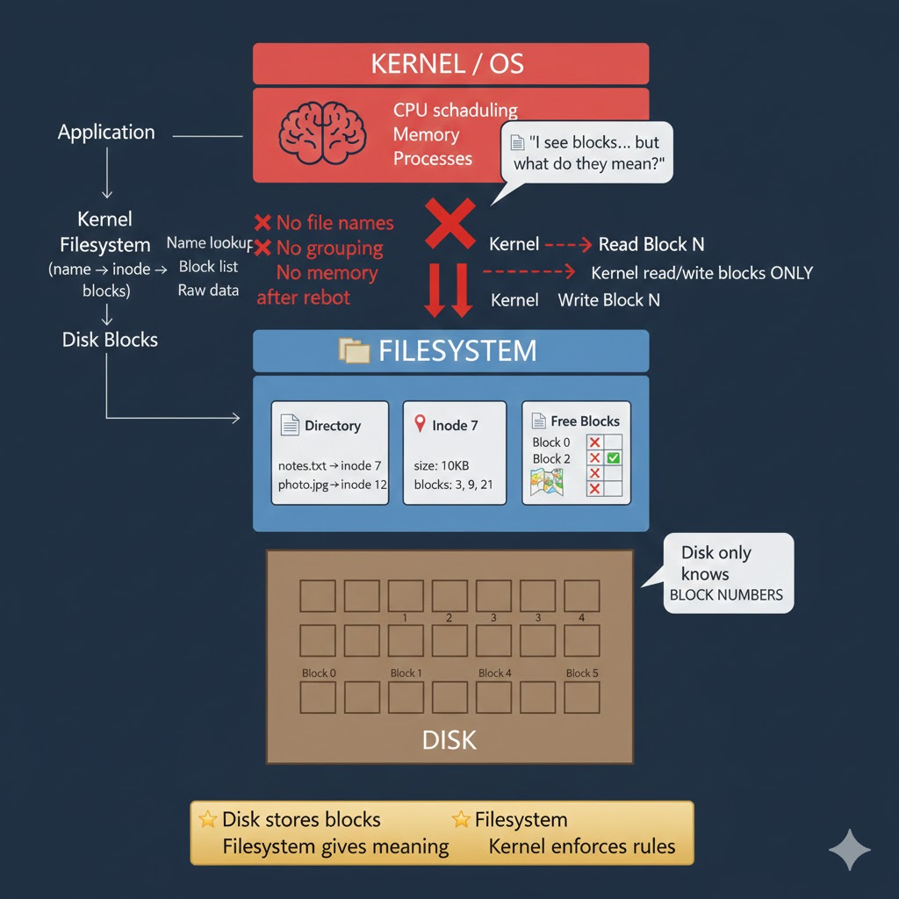
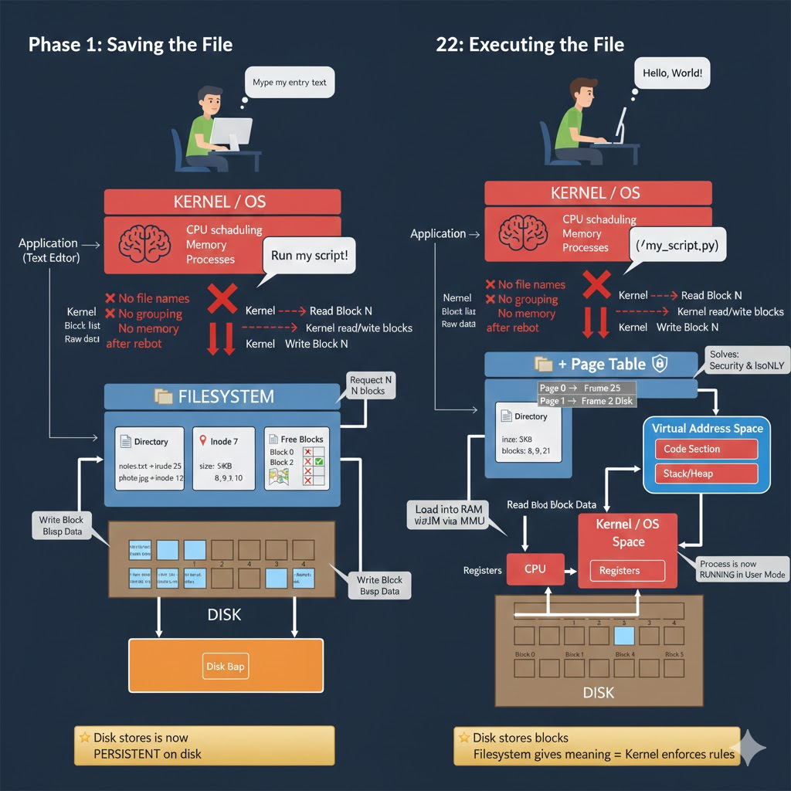

# Filesystem Explained (From Blocks to Files) — Easy & Visual

## Goal
Understand **what a filesystem is**, **why the kernel alone is not enough**, and **how files actually exist**, using **simple language, examples, and diagrams**.

---

## 1. Start From the Disk (Reality)

A disk is just storage divided into **blocks**.

```
DISK
+-----------------------------+
| Block 0 | Block 1 | Block 2 |
| Block 3 | Block 4 | Block 5 |
| Block 6 | Block 7 | Block 8 |
+-----------------------------+
```

The disk only understands:
- Read block N
- Write block N

It does **not** understand files or names.

---

## 2. What the Kernel Can Do Without Filesystem

The kernel can read and write blocks directly.

```
KERNEL
  |
  |-- read block 5
  |-- write block 12
  |
DISK
```

But after reboot, the kernel only sees block numbers.
It does not know what those blocks mean.

---

## 3. The Problem Filesystem Solves

Humans want:
- Names (notes.txt)
- Grouping of data
- Persistence across reboot
- Safety from overwrites

Blocks alone cannot provide this.

---

## 4. Filesystem = Index + Rules

A filesystem is an **index and bookkeeping system** stored on disk that gives meaning to blocks.

---

## 5. Filesystem Layer (Visual)

```
+-------------------+
|     KERNEL        |
+-------------------+
          |
          v
+-------------------+
|   FILESYSTEM      |
|-------------------|
| Directory (names) |
| Inodes (info)     |
| Free block map    |
+-------------------+
          |
          v
+-------------------+
|      DISK         |
|  (blocks only)    |
+-------------------+
```

---

## 6. Directory (Names)

A directory maps names to inode numbers.

```
notes.txt  -> inode 7
photo.jpg -> inode 12
```

---

## 7. Inode (File Information)

An inode stores metadata and block locations.

```
inode 7:
  size = 10 KB
  blocks = [3, 9, 21]
```

---

## 8. What a File Really Is

```
File name
   |
   v
 inode
   |
   v
 blocks on disk
```

Files are **not stored contiguously**.

---

## 9. Reading a File

```
Application
   |
Kernel
   |
Filesystem (name -> inode -> blocks)
   |
Disk
```

---

## 10. Writing and Deleting Files

Writing:
- allocate free blocks
- update inode
- write data

Deleting:
- remove name
- free inode
- mark blocks free

Data is not immediately erased.

---

## 11. Kernel vs Filesystem

Kernel:
- runs programs
- enforces rules

Filesystem:
- remembers structure
- remembers meaning

---

## 12. Golden Mental Model

```
Disk        -> blocks
Filesystem -> meaning
Kernel     -> enforcement
```

---

## Final Summary

A filesystem is what turns raw disk blocks into named, persistent, safe files the kernel can use.


