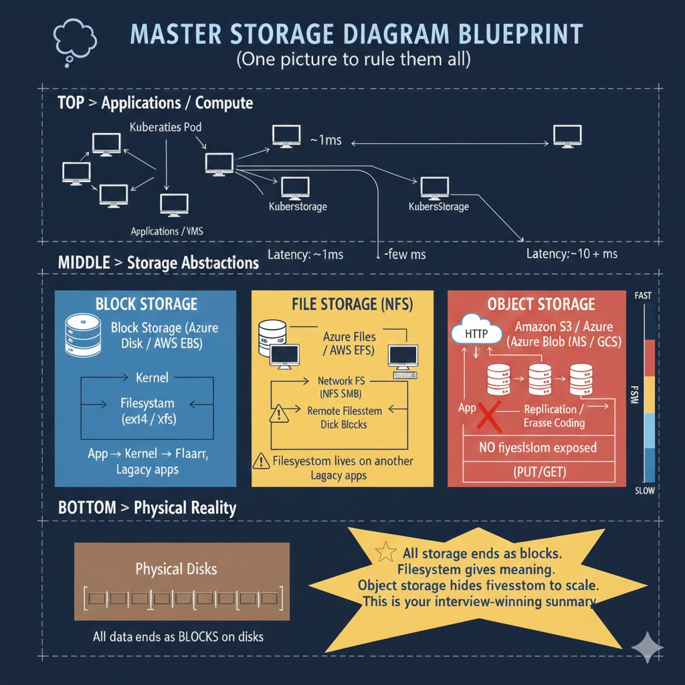

# Cloud Storage Explained from First Principles
## From Disk Blocks to Filesystems to Object / Blob Storage

This document explains **how all storage ultimately ends at disk blocks**, why **filesystems exist**, and why cloud providers expose **block, file, and object (blob) storage**.

---

## 1. Universal Truth

> Everything is ultimately stored as blocks on physical disks (SSD or HDD).

Cloud services differ only in **who manages the filesystem** and **how you access the data**.

---

## 2. Disk and Blocks

A disk is divided into fixed-size blocks.

```
DISK
+-----------------------------+
| Block 0 | Block 1 | Block 2 |
| Block 3 | Block 4 | Block 5 |
| Block 6 | Block 7 | Block 8 |
+-----------------------------+
```

The disk understands only:
- read block N
- write block N

No files, names, or folders exist here.

---

## 3. Filesystem: Giving Meaning to Blocks

A filesystem writes metadata into some blocks to track:
- which blocks are free
- which blocks belong to a file
- file names, permissions, ownership

> Filesystem = structure + meaning on top of blocks

---

## 4. Formatting a Disk

When you receive a new disk (cloud or on‑prem):

- it contains empty blocks
- no filesystem exists

Formatting (`mkfs.ext4`) writes filesystem structures:
- superblock
- inode tables
- free block maps

Some blocks are now used by the filesystem itself.

---

## 5. Kernel and Filesystem

- Kernel: reads/writes blocks and enforces rules
- Filesystem: remembers structure and meaning

> Kernel enforces, filesystem remembers.

---

## 6. Block Storage

Examples:
- Azure Managed Disk
- AWS EBS
- GCP Persistent Disk

Architecture:

```
Application
  ↓
Kernel
  ↓
Filesystem (you manage)
  ↓
Block Storage (disk)
```

Characteristics:
- low latency
- strong consistency
- ideal for databases and VM disks

---

## 7. File Storage (Network File Systems)

Examples:
- Azure Files
- AWS EFS
- NFS / SMB

Architecture:

```
Application
  ↓
Kernel
  ↓
Network Filesystem
  ↓
Remote Filesystem
  ↓
Disks
```

Characteristics:
- shared access
- higher latency than local disk
- filesystem semantics preserved

---

## 8. Why Network File Storage Is Slower

Every operation involves:
- network communication
- remote metadata checks
- locking across machines

---

## 9. Object / Blob Storage

Examples:
- AWS S3
- Azure Blob Storage
- Google Cloud Storage

Object storage:
- is NOT a filesystem
- exposes HTTP / REST APIs
- stores whole objects

Operations:
```
PUT object
GET object
DELETE object
```

---

## 10. Object Storage Mental Model

Think of Google Drive or Dropbox:
- you upload objects
- you download objects
- you never see disks or filesystems

---

## 11. Internal Reality of Object Storage

Internally, object storage:
- uses many disks and machines
- splits objects into chunks
- stores chunks redundantly
- verifies data with checksums

Filesystems exist internally but are **never exposed**.

---

## 12. Same AZ vs Cross‑Region

- Same AZ: low latency, fast access
- Cross‑region: higher latency, extreme durability

Used for backups and disaster recovery.

---

## 13. Latency Comparison

| Storage Type | Typical Latency |
|-------------|----------------|
| Local SSD | microseconds |
| Block Disk | ~1 ms |
| Network FS | few ms |
| Object Storage | tens to hundreds of ms |

---

## 14. When to Use What

| Use Case | Storage Type |
|--------|--------------|
| Databases | Block storage |
| VM root disks | Block storage |
| Shared directories | File storage |
| Media files | Object storage |
| Backups | Object storage |
| Logs | Object storage |

---

## 15. Final Summary

> All data ends as blocks on disks.
Block storage exposes disks.
File storage exposes a managed filesystem.
Object storage hides filesystems to achieve scale and durability.
