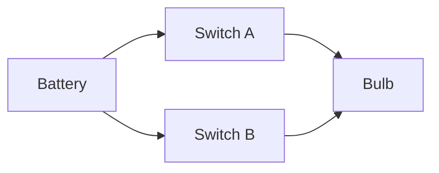
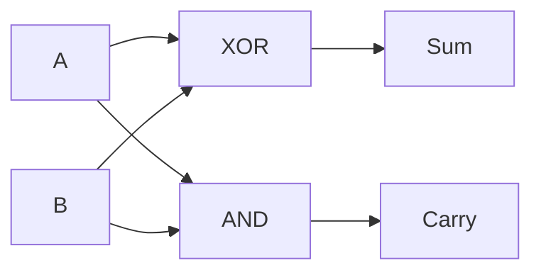
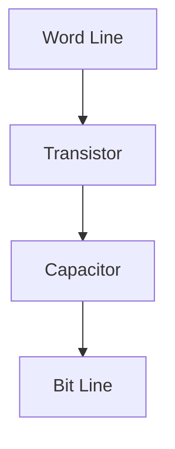
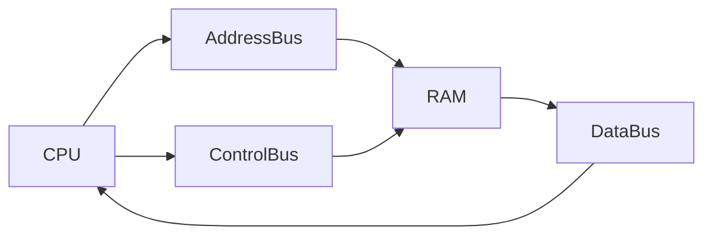

# From Humans to CPUs – A Physical & Electrical Journey
https://www.youtube.com/watch?v=7ge7u5VUSbE&list=PL9vTTBa7QaQPdvEuMTqS9McY-ieaweU8M
> **Goal of this document**
> Explain how computing evolved **step by step**, starting from humans doing calculations manually, moving through calculators, logic gates, memory, RAM, and finally the CPU — **purely from a physical and electrical perspective**.

This is *not* a software-first explanation. It is about **wires, switches, electricity, and control**.

---

## 1. Before Machines: Humans as the Computer

### How calculations were done

* Humans used **brain + paper**
* Numbers were written
* Calculations were manual

**Problems**:

* Slow
* Error-prone
* No automation
* No repeatability


Humans were both the **processor** and the **memory**.

---

## 2. Mechanical Calculators: Automating Math

### Why calculators were invented

Humans wanted:

* Faster calculations
* Less error

### How early calculators worked

* Gears and wheels
* Like an odometer
* Each rotation = +1


**Limitation**:

* Mechanical wear
* Hard to scale

---

## 3. Electronics Enter the Picture

### Key discovery

Electricity naturally has **two states**:

* Voltage present → ON
* No voltage → OFF

This maps perfectly to:

```
1 and 0
```

This is why computers use **binary**.

---

## 4. Logic Gates from Physical Switches

### AND gate (series switches)

Bulb lights only if **both switches are ON**.


### OR gate (parallel switches)

Bulb lights if **any switch is ON**.



### NOT gate

Flips the signal:

* ON → OFF
* OFF → ON

---

## 5. XOR: Detecting Difference

XOR means:

> Output is ON **only if inputs are different**

Truth behavior:

* 0,0 → 0
* 0,1 → 1
* 1,0 → 1
* 1,1 → 0

XOR is built using:

* AND
* OR
* NOT

---

## 6. Arithmetic from Gates: Adders

### Half Adder

Adds two bits:

* **Sum** = XOR
* **Carry** = AND



### Limitation

Cannot accept carry from previous bit.

---

### Full Adder

Adds:

* Bit A
* Bit B
* Carry-in

Built using:

* Two Half Adders
* One OR gate

This enables **multi-bit addition**.

---

## 7. Calculators as Fixed Machines

Early electronic calculators:

* Contained adders
* Contained registers
* Contained fixed control logic

**Important**:

* Hardware was **hard-wired**
* Behavior could NOT change

To change behavior → rebuild hardware.

---

## 8. The Need for Memory

### Problem

* Results disappear once inputs are removed

### Solution: Feedback loops

If output feeds back into input:

* Circuit can hold state

This is the **birth of memory**.

---

## 9. Latches and Flip-Flops

### Latch

* Stores 1 bit
* Uses feedback
* Changes anytime input changes

### Flip-Flop

* Latch + **clock**
* Updates only at clock edge

Clock = repeating electrical pulse:

```
ON → OFF → ON → OFF
```

---

## 10. Registers

A register is:

* A group of flip-flops
* Stores a binary number

Example:

```
10110101
```

Registers are:

* Very fast
* Very small

---

## 11. SRAM and DRAM

### SRAM (Static RAM)

* Built from flip-flops
* No refresh
* Fast
* Expensive

Used for:

* CPU caches

---

### DRAM (Dynamic RAM)

* 1 transistor + 1 capacitor per bit
* Stores charge
* Needs refresh
* Dense and cheap

Used for:

* Main memory (RAM sticks)

---

## 12. RAM as Rows and Columns

Memory cells are arranged in a **grid**.

* Row wires = word lines
* Column wires = bit lines



Only the selected row + column forms a path.
No overlap occurs.

---

## 13. Why CPU Was Needed

Calculators had:

* Adders
* Registers
* Memory

But:

* Control was fixed
* No instruction sequence

### Big idea

> Store **instructions** in memory just like data.

This creates a **programmable machine**.

---

## 14. CPU: The Controller

CPU is **hardware**, not software.

CPU contains:

* Control Unit (decodes instructions)
* ALU (does math)
* Registers (fast storage)

CPU runs a loop:

```
FETCH → DECODE → EXECUTE
```

---

## 15. How CPU Talks to RAM (Physically)

They are connected by **buses** (wires):

* Address Bus → which location
* Data Bus → actual bits
* Control Bus → read / write



Fetching = placing voltage on wires and sensing it.

---

## 16. What a Data Bus Really Is

A **data bus** is:

* A group of parallel wires
* Each wire carries 1 bit

Example (8-bit bus):

```
Wire0 Wire1 Wire2 Wire3 Wire4 Wire5 Wire6 Wire7
```

Voltage pattern = binary value.

---

## 17. Final Mental Model

```
Electricity
  ↓
Switches & Gates
  ↓
Adders (Math)
  ↓
Flip-Flops (Memory)
  ↓
Registers / RAM
  ↓
CPU Control Logic
```

---

## 18. One Sentence That Explains Everything

> **A computer is an electrical machine that uses switches to perform logic, feedback to store state, and control logic to execute instructions stored in memory.**

---

### End of Document
