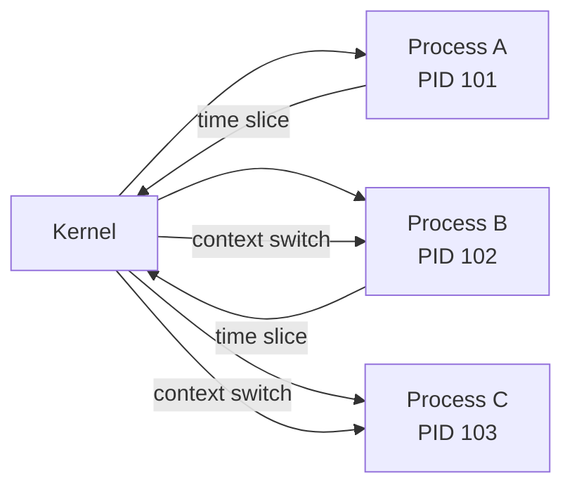
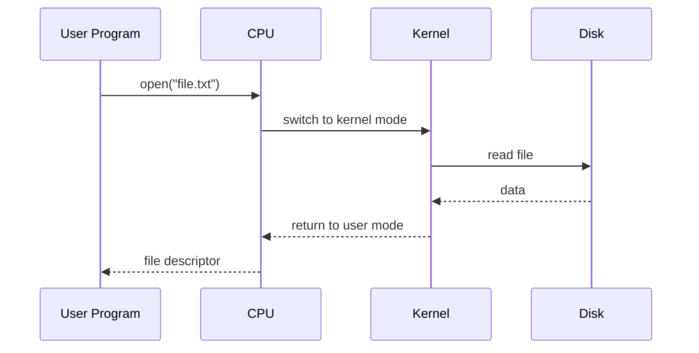

# From Power Button to Running Programs  
## End-to-End Flow: CPU, Firmware, Kernel, and Processes

This document explains **how a computer goes from power-on to running multiple user programs**, step by step, from first principles.
It connects **CPU behavior, firmware, kernel, and processes** into one clean mental model, with **visual Mermaid diagrams**.

---

## 1. Power-On: Nothing Exists Yet

When you press the power button:

- RAM is empty (volatile)
- No OS is running
- No processes exist
- Only **hardware and firmware** remain

### What the CPU does

- CPU resets internal state
- Program Counter (PC) is set to a **fixed hardware-defined address**
- This address points to **firmware**

```
PC = RESET_VECTOR
```

---

## 2. Firmware (BIOS / UEFI) Runs First

Firmware is stored in **ROM / flash** on the motherboard.

### Firmware responsibilities

- Initialize CPU and RAM
- Perform basic hardware checks
- Locate a bootable device
- Load the bootloader into RAM

### Memory view

```
ROM:
+-------------------+
| Firmware          |
+-------------------+

RAM:
(empty)
```

---

## 3. Bootloader Loads the Kernel

Firmware loads a **bootloader** from disk into RAM and jumps to it.

The bootloader:
- Understands disk layout and filesystem
- Locates the kernel file
- Copies kernel into RAM
- Jumps to kernel entry point

---

## 4. Kernel Takes Control (Fresh Every Boot)

The kernel is now running in **privileged (kernel) mode**.

### Kernel initialization

- Sets up memory management
- Enables virtual memory (MMU)
- Sets up interrupts and scheduler
- Initializes devices
- Creates the **first user-space process**

In Linux, this first process is traditionally:

```
PID 1 (init / systemd)
```

---

## 5. Visual: Bootstrapping Flow

```mermaid
flowchart TD
    A[Power Button Pressed] --> B[CPU Reset]
    B --> C[PC set to Firmware Address]
    C --> D[Firmware (BIOS/UEFI)]
    D --> E[Bootloader Loaded]
    E --> F[Kernel Loaded into RAM]
    F --> G[Kernel Initialization]
    G --> H[PID 1 Started]
```

---

## 6. What Is PID 1 and Why It Matters

PID 1:
- Is the **first user-space process**
- Started directly by the kernel
- Responsible for starting other system services

Kernel always remains running in the background.
User-space programs come and go.

---

## 7. User Requests a Program to Run

A user (via shell or UI) requests:

```
run my_program.py
```

This request:
- Is handled by an existing process (shell)
- Uses a **system call** to ask the kernel

---

## 8. Kernel Turns Program into a Process

The kernel performs these steps:

1. Creates a new process (PID)
2. Loads program code into RAM
3. Allocates stack and heap
4. Sets up a **virtual address space**
5. Switches CPU to **user mode**
6. Schedules the process

This is where:

> **Program → Process**

---

## 9. While One Program Is Running, Another Starts

Modern OSes are multitasking systems.

While Program A is running:
- Kernel can pause it
- Save its CPU state
- Run Program B
- Later resume Program A

This switching is done by the **kernel scheduler**.

---

## 10. Visual: Kernel Scheduling Multiple Programs



---

## 11. User Mode vs Kernel Mode (Security Core)

- User programs run in **user mode**
- Kernel runs in **kernel (privileged) mode**
- CPU enforces the separation

### Rule

> All dangerous operations (I/O, memory control, process creation) must go through the kernel.

This is done using **system calls**.

---

## 12. Example: Program Opens a File

1. Program runs in user mode
2. Calls `open("file.txt")`
3. CPU traps into kernel mode
4. Kernel validates request
5. Kernel performs disk I/O
6. CPU returns to user mode

---

## 13. Visual: User Program → Kernel → User Program



---

## 14. Clean Mental Model (Remember This)

- Firmware always runs first
- Kernel is loaded fresh every boot
- Kernel is the boss
- Processes are temporary
- CPU switches modes to enforce safety

---

## 15. One-Line Summary

> From power-on to running applications, the CPU always starts with firmware, loads the kernel into RAM, and the kernel safely creates and manages processes by controlling memory, CPU modes, and execution.

---

End of document.


