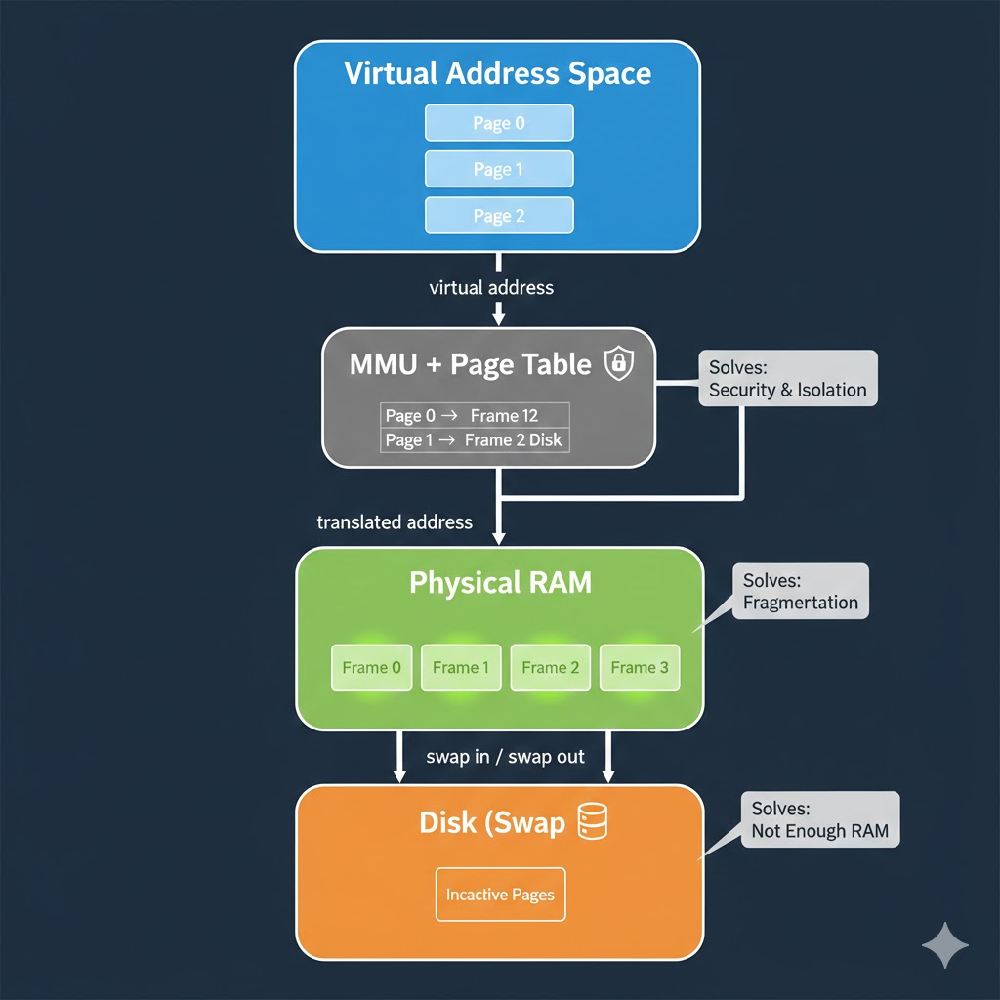

# Paging & Virtual Memory — From First Principles
 ### it is for memory managemnt
This document explains **paging** and **virtual memory** in a simple, durable way and shows **how they solve the three fundamental memory problems**:
1. Not enough memory
2. Memory fragmentation
3. Security / isolation

This is written to be *remembered*, not just read.

---

## 1. The Core Problem

The CPU can only execute instructions on **data that is in RAM**.
But:
- RAM is limited
- Many programs run at the same time
- Programs must not corrupt each other

If programs used RAM directly, systems would:
- Crash when RAM is full
- Waste memory due to fragmentation
- Be insecure

Operating systems needed a solution.

---

## 2. What Is Virtual Memory?

**Virtual memory** is an OS illusion.

> Each program is given the illusion that it has its own private, continuous memory starting at address 0.

In reality:
- All programs share the same physical RAM
- The OS and hardware translate addresses behind the scenes

Programs never see real RAM addresses.
They only see **virtual addresses**.

---

## 3. Why Paging Is Required

If the OS tried to manage memory **byte-by-byte**, it would need:
- Billions of mappings
- Huge tables
- Very slow lookups

This is impossible.

So memory is managed in **fixed-size chunks**.

---

## 4. What Is a Page?

A **page** is a fixed-size chunk of memory.

Typical size:
- 4 KB (4096 bytes)

Two views exist:

- **Virtual page** → what the program sees
- **Physical frame** → where it actually lives in RAM

Pages and frames are always the same size.

---

## 5. Paging Solves Fragmentation (Example)

### Without Paging (Problem)

RAM (used = X, free = .):

X . X . X . . .

A program needs 3 units of memory.
Total free space exists, but not **contiguously**.

Result:
- Out of memory ❌

This is **external fragmentation**.

---

### With Paging (Solution)

RAM is divided into fixed-size frames:

[Frame][Frame][Frame][Frame]...

The program is split into pages:

Page 0 → Frame 2  
Page 1 → Frame 4  
Page 2 → Frame 6  

Pages can be placed **anywhere**.

Result:
- Fragmentation eliminated ✅
- RAM fully usable

---

## 6. How Address Translation Works (Simplified)

When a program accesses memory:

1. CPU generates a **virtual address**
2. MMU finds the page number
3. Page table maps it to a frame
4. Physical address is produced
5. Data is loaded into CPU registers

This happens in hardware and is extremely fast.

---

## 7. Paging Solves Not Enough Memory (Swap)

RAM is limited, disk is large.

Paging allows the OS to:
- Keep **active pages** in RAM
- Move **inactive pages** to disk (swap)

This frees RAM without killing programs.

Important:
- CPU never executes from disk
- Pages must be brought back to RAM before use

Result:
- System slows down, but does not crash ✅

---

## 8. Paging Solves Security & Isolation

Each process has its **own page table**.

The MMU checks every memory access:
- Is this page mapped?
- Is it readable?
- Is it writable?

Illegal access:
- Page fault
- Process is terminated
- Other programs remain safe

Result:
- Strong isolation
- Secure multi‑program systems

---

## 9. The Three Problems and the One Solution

| Problem | How Paging + Virtual Memory Fix It |
|------|-----------------------------------|
| Not enough RAM | Swap inactive pages to disk |
| Fragmentation | Fixed-size pages placed anywhere |
| Security | Per-process page tables + MMU checks |

One mechanism solves all three.

---

## 10. One Diagram to Remember

Disk → RAM (pages/frames) → Cache → Registers → CPU

Paging controls **what is allowed to move closer to the CPU**.

---

## 11. One-Sentence Summary (Memorize This)

> Paging allows memory to be managed in fixed-size chunks so programs can be isolated, RAM can be used efficiently, and systems can survive memory pressure using disk as overflow.

---

## 12. Interview-Ready Explanation

“Paging splits memory into fixed-size pages so a program’s memory doesn’t need to be contiguous. Virtual memory maps those pages to physical RAM frames and optionally disk, which eliminates fragmentation, provides isolation, and allows systems to run even when RAM is full.”

### ref:
https://www.youtube.com/watch?v=ultz9m0n0GE

https://www.youtube.com/watch?v=fGP6VHxqkIM

https://www.youtube.com/watch?v=A9WLYbE0p-I
https://www.youtube.com/watch?v=fGP6VHxqkIM

