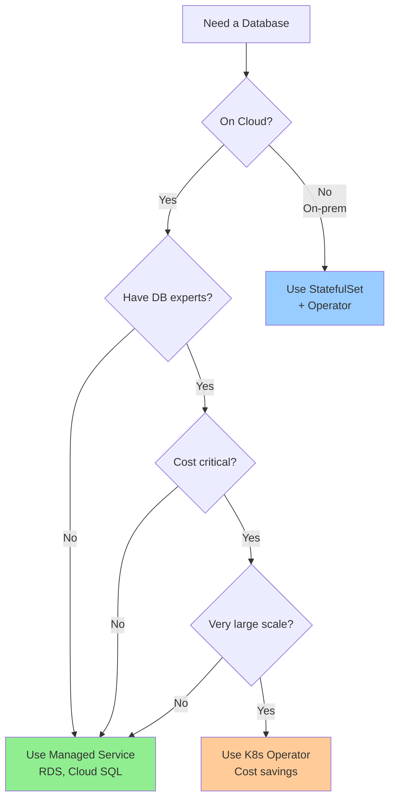

# Managed Database vs Kubernetes StatefulSet

## Quick Comparison

| Aspect | Managed Database Service | Kubernetes StatefulSet |
|--------|-------------------------|------------------------|
| **Examples** | AWS RDS, Azure Database, Cloud SQL | MySQL on K8s, PostgreSQL on K8s |
| **Who Manages** | Cloud provider | You (or operator) |
| **Setup Time** | 5-10 minutes | Hours to days |
| **Complexity** | Low (click & deploy) | High (write YAML, configure) |
| **Cost** | Higher ($$$) | Lower ($$) but more work |
| **Control** | Limited | Full control |
| **Location** | Cloud only | Anywhere (on-prem, multi-cloud) |

---

## High Availability (HA)

| Feature | Managed Service | StatefulSet (Manual) | StatefulSet (Operator) |
|---------|----------------|---------------------|----------------------|
| **Setup HA** | Click a checkbox ☑️ | Write complex scripts | Configure in YAML |
| **Automatic Failover** | ✅ Yes (built-in) | ❌ No | ✅ Yes |
| **Failover Time** | 30-60 seconds | 60-120 seconds (manual) | 30-60 seconds (auto) |
| **Multi-AZ** | ✅ Yes (easy) | ✅ Yes (manual config) | ✅ Yes (configured) |
| **Health Monitoring** | ✅ Built-in | ❌ You build it | ✅ Built-in |
| **Load Balancing** | ✅ Automatic | ❌ Manual setup | ✅ Automatic (via router) |

---

## Disaster Recovery (DR)

| Feature | Managed Service | StatefulSet (Manual) | StatefulSet (Operator) |
|---------|----------------|---------------------|----------------------|
| **Automated Backups** | ✅ Yes (daily, configurable) | ❌ You write scripts | ✅ Yes (scheduled) |
| **Point-in-Time Recovery** | ✅ Yes | ❌ Complex to implement | ⚠️ Depends on operator |
| **Backup Storage** | ✅ Managed by provider | ❌ You manage (S3, etc.) | ✅ Configured (S3, GCS) |
| **Cross-Region Backup** | ✅ Easy to enable | ❌ You implement | ✅ Configurable |
| **Restore Time** | Minutes (click button) | Hours (manual process) | 30-60 minutes (automated) |
| **Backup Retention** | ✅ Configurable (7-35 days) | ❌ You manage | ✅ Configurable |

---

## Replication

| Feature | Managed Service | StatefulSet (Manual) | StatefulSet (Operator) |
|---------|----------------|---------------------|----------------------|
| **Setup Replication** | ✅ Click to enable | ❌ Complex SQL commands | ✅ Automatic |
| **Primary-Replica** | ✅ Built-in | ❌ You configure | ✅ Automatic |
| **Read Replicas** | ✅ Easy (add with click) | ❌ Manual setup | ✅ Scale replicas up |
| **Async Replication** | ✅ Default | ✅ You configure | ✅ Supported |
| **Sync Replication** | ✅ Available | ❌ Complex to setup | ✅ Supported (Group Repl) |
| **Cross-Region Replica** | ✅ Supported | ❌ Very complex | ⚠️ Complex but possible |
| **Replica Lag Monitoring** | ✅ Built-in dashboard | ❌ You build it | ✅ Built-in metrics |

---

## Operational Effort

| Task | Managed Service | StatefulSet (Manual) | StatefulSet (Operator) |
|------|----------------|---------------------|----------------------|
| **Initial Setup** | 10 minutes | 8-40 hours | 2-4 hours |
| **Upgrades** | Click button (zero downtime) | Manual, risky | Rolling update (operator) |
| **Patching** | ✅ Automatic | ❌ You patch OS & DB | ⚠️ You patch OS |
| **Monitoring** | ✅ Built-in (CloudWatch, etc.) | ❌ Setup Prometheus, etc. | ✅ Some built-in |
| **Scaling** | Click to scale | Modify StatefulSet | Modify custom resource |
| **Security Updates** | ✅ Automatic | ❌ Your responsibility | ⚠️ Your responsibility |
| **24/7 Support** | ✅ Paid support available | ❌ DIY | ⚠️ Community support |

---

## Cost Comparison

| Type | Monthly Cost (example) | Your Effort |
|------|----------------------|-------------|
| **Managed Service** | $200-500 (db.m5.large) | 1-2 hours/month |
| **StatefulSet (Manual)** | $50-100 (compute only) | 20-40 hours/month |
| **StatefulSet (Operator)** | $50-100 (compute only) | 5-10 hours/month |

**Hidden Costs:**
- **Managed:** Higher price, but includes expertise
- **StatefulSet:** Lower compute cost, but high labor cost

**Break-even:**
```
If your team's time = $100/hour:
- Manual: $50 + (30 hours × $100) = $3,050/month
- Managed: $300/month

Managed service is cheaper! 💰
```

---

## When to Use Managed Database Service

✅ **Use Managed Database When:**

| Scenario | Why |
|----------|-----|
| **Startup/Small Team** | Don't have DB experts |
| **Fast Time-to-Market** | Need to launch quickly |
| **Limited Ops Team** | No one to manage DB 24/7 |
| **Business Critical** | Can't afford downtime |
| **Compliance Required** | Automated backups, encryption |
| **Cloud-Native App** | Already using AWS/Azure/GCP |
| **Focus on Product** | DB is not your differentiator |

**Example Use Cases:**
- SaaS applications
- Web applications
- Mobile app backends
- E-commerce sites
- Most standard workloads

---

## When to Use Kubernetes StatefulSet

✅ **Use StatefulSet When:**

| Scenario | Why |
|----------|-----|
| **On-Premises** | Must run in your datacenter |
| **Multi-Cloud** | Avoid vendor lock-in |
| **Custom Database** | Not available as managed service |
| **Cost-Sensitive** | Very large scale, compute costs matter |
| **Full Control Needed** | Special configs, custom builds |
| **Hybrid Cloud** | Data sovereignty requirements |
| **Already on K8s** | Everything else on Kubernetes |

**Example Use Cases:**
- Banks (data sovereignty)
- Large enterprises (on-prem)
- Custom databases (Cassandra, CockroachDB)
- Airgapped environments
- Multi-region, multi-cloud

---

## Feature Comparison Table

| Feature | Managed Service | K8s Manual StatefulSet | K8s with Operator |
|---------|----------------|----------------------|------------------|
| **HA Setup** | ⭐⭐⭐⭐⭐ Easy | ⭐⭐ Hard | ⭐⭐⭐⭐ Easy |
| **Auto-Failover** | ✅ | ❌ | ✅ |
| **Auto-Backup** | ✅ | ❌ | ✅ |
| **Monitoring** | ✅ | ❌ | ⚠️ Partial |
| **Security Patches** | ✅ Auto | ❌ Manual | ❌ Manual |
| **Cost** | $$$ | $ | $$ |
| **Control** | ⭐⭐ Limited | ⭐⭐⭐⭐⭐ Full | ⭐⭐⭐⭐ High |
| **Portability** | ❌ Vendor lock-in | ✅ Portable | ✅ Portable |
| **Ops Effort** | Low | Very High | Medium |
| **Expertise Needed** | None | High | Medium |

---

## Real-World Decision Matrix

### Small Company (< 50 employees)

```
Use Managed Database ✅

Reasons:
- No dedicated ops team
- Focus on product, not infrastructure
- Want proven reliability
- Can't afford downtime

Example: AWS RDS, Google Cloud SQL
```

---

### Medium Company (50-500 employees)

```
Hybrid Approach ⚖️

Managed for most workloads ✅
StatefulSet + Operator for:
- Cost optimization (very large DBs)
- Compliance requirements
- Multi-cloud strategy

Example:
- Production: RDS
- Analytics: K8s StatefulSet (cheaper for large data)
```

---

### Large Enterprise (500+ employees)

```
Kubernetes with Operators ✅

Reasons:
- Have platform engineering team
- Multi-cloud, on-prem needs
- Cost savings at scale
- Need full control
- Compliance/data sovereignty

Example:
- Use operators (Percona, CockroachDB)
- Some managed services for non-critical
```

---

## HA Comparison: Real Example

### Scenario: Primary Database Fails

#### Managed Service (AWS RDS Multi-AZ)

```
Time 0s:  Primary fails in us-east-1a
Time 30s: AWS detects failure
Time 60s: Standby promoted in us-east-1b
Time 65s: DNS updated to new primary
Time 70s: Application reconnects

Downtime: ~70 seconds
Your Action: None (AWS handles it)
Data Loss: None
```

#### StatefulSet with Operator

```
Time 0s:  mysql-0 pod fails
Time 3s:  Other pods detect failure
Time 5s:  mysql-1 elected as primary
Time 10s: Router updates to mysql-1
Time 15s: Application reconnects

Downtime: ~15 seconds
Your Action: None (operator handles it)
Data Loss: None (if replication configured)
```

#### StatefulSet Manual

```
Time 0s:   mysql-0 pod fails
Time 60s:  StatefulSet recreates mysql-0
Time 120s: mysql-0 comes back online
Time 121s: Application reconnects

Downtime: ~120 seconds
Your Action: None for restart, but no failover
Data Loss: None (PVC preserved)

Note: If you want mysql-1 to take over:
- You manually promote mysql-1
- Update app config
- Additional 30 minutes of work
```

---

## DR Comparison: Backup & Restore

### Daily Backup

| Step | Managed Service | StatefulSet Manual | StatefulSet Operator |
|------|----------------|-------------------|---------------------|
| **Setup** | Enable in console | Write CronJob + script | Configure in YAML |
| **Schedule** | Daily 2 AM (pick time) | Cron: `0 2 * * *` | Schedule in spec |
| **Storage** | Managed by provider | Upload to S3 (you manage) | Configured S3/GCS |
| **Retention** | 7 days (configurable) | Delete old (you script it) | Configurable |
| **Monitoring** | Email on failure | ❌ You build alerts | ✅ Built-in alerts |

### Restore from Backup

| Step | Managed Service | StatefulSet Manual | StatefulSet Operator |
|------|----------------|-------------------|---------------------|
| **Trigger** | Click "Restore" | Run restore script | Create restore CR |
| **Time** | 10-30 minutes | 1-2 hours (manual) | 30-60 minutes |
| **Verification** | Automatic health check | ❌ You verify | ✅ Automatic verify |
| **Effort** | 5 minutes (just clicks) | 2-4 hours (manual work) | 30 minutes (monitor) |

---

## Replication Setup Comparison

### Setting up Primary + 2 Replicas

#### Managed Service (AWS RDS)

```
1. Create database (5 minutes)
2. Enable Multi-AZ (checkbox)
3. Add read replica (click + select region)
4. Add second read replica (click + select region)

Total Time: 15 minutes
Complexity: ⭐ Very easy
```

#### StatefulSet Manual

```
1. Write StatefulSet YAML (2-4 hours)
2. Configure mysql-0 as primary (1 hour)
3. Setup replication user (30 minutes)
4. Configure mysql-1 to replicate from mysql-0 (2 hours)
5. Configure mysql-2 to replicate from mysql-0 (30 minutes)
6. Test failover scenarios (4 hours)
7. Write runbooks (2 hours)

Total Time: 12-16 hours
Complexity: ⭐⭐⭐⭐⭐ Very hard
```

#### StatefulSet with Operator

```yaml
# 1. Install operator (5 minutes)
# 2. Create cluster (2 minutes)
apiVersion: ps.percona.com/v1alpha1
kind: PerconaServerMySQL
metadata:
  name: cluster1
spec:
  mysql:
    size: 3  # 1 primary + 2 replicas

Total Time: 30-60 minutes
Complexity: ⭐⭐ Easy
```

---

## Summary Table

| Factor | Managed Service | StatefulSet Manual | StatefulSet Operator |
|--------|----------------|-------------------|---------------------|
| **Setup Time** | ⏱️ 10 min | ⏱️ 8-40 hours | ⏱️ 2-4 hours |
| **HA Setup** | ✅ Built-in | ❌ Complex | ✅ Automatic |
| **DR/Backup** | ✅ Automatic | ❌ DIY | ✅ Configured |
| **Replication** | ✅ Easy | ❌ Hard | ✅ Easy |
| **Failover** | ✅ Auto | ❌ Manual | ✅ Auto |
| **Monitoring** | ✅ Built-in | ❌ DIY | ⚠️ Partial |
| **Upgrades** | ✅ Zero-downtime | ❌ Risky | ✅ Rolling |
| **Cost** | $$$ | $ | $$ |
| **Control** | ⭐⭐ | ⭐⭐⭐⭐⭐ | ⭐⭐⭐⭐ |
| **Ops Effort** | Low | Very High | Medium |
| **Portability** | ❌ | ✅ | ✅ |
| **Best For** | Most companies | Experts only | K8s platforms |

---

## Decision Tree



---

## Key Recommendations

### For 90% of Companies
**Use Managed Database Service** (AWS RDS, Azure Database, Cloud SQL)

**Why?**
- ✅ Less expensive (considering labor)
- ✅ More reliable (proven at scale)
- ✅ Faster to deploy
- ✅ Less operational burden
- ✅ Built-in HA, DR, backups

---

### For Kubernetes-First Companies
**Use Kubernetes Operators** (Percona, CloudNativePG)

**Why?**
- ✅ Everything in Kubernetes
- ✅ Multi-cloud portability
- ✅ Full control
- ✅ Cost savings at large scale
- ✅ Automated operations

---

### Never Use
**Manual StatefulSet** (without operator)

**Why?**
- ❌ Too much work
- ❌ Error-prone
- ❌ Requires deep expertise
- ❌ Poor reliability
- ❌ Not worth the effort

**Exception:** Learning/education only

---

## Final Verdict

| If You Are... | Use This |
|--------------|----------|
| **Startup** | Managed Service (RDS, Cloud SQL) ⭐ |
| **Enterprise with K8s platform** | Operator (Percona, CloudNativePG) ⭐ |
| **On-premises only** | Operator (no choice) |
| **Learning** | Manual StatefulSet (educational) |
| **99% of companies** | Managed Service (simplest) ⭐⭐⭐ |

**Bottom Line:** Unless you have strong reasons (on-prem, multi-cloud, cost at huge scale), use managed database services. They're simpler, more reliable, and cheaper when you count labor costs.
