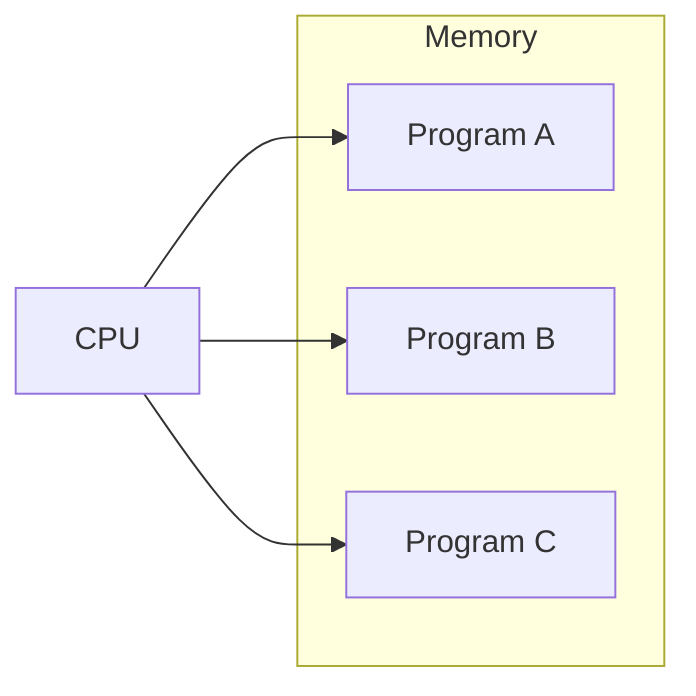
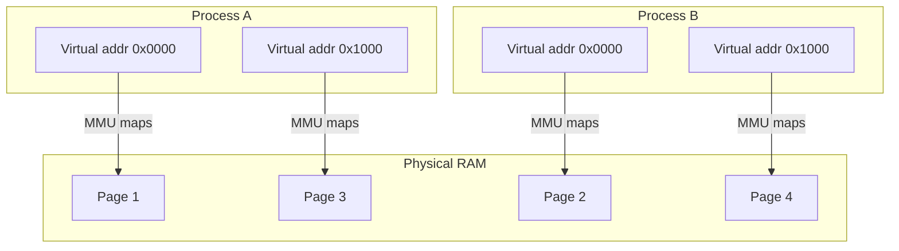

# Chunk 1 – Very Basics: CPU, Memory, Program, Process

## 1. CPU (Brain)

- **CPU** = Central Processing Unit.  
- Executes instructions like “add”, “compare”, “jump”.  
- Reads instructions and data from **memory (RAM)**, not directly from disk.[web:54]

## 2. Memory / RAM (Workspace)

- **RAM** = Random Access Memory.  
- Fast **workspace** for the CPU:
  - Program code is loaded here from disk.
  - Variables and data live here while the program runs.  
- Content is lost when power is off.[web:54]

## 3. Program vs Process

- **Program**:
  - File on disk with instructions (e.g., `/usr/bin/python`, `app.exe`).
  - Not running, just stored.

- **Process**:
  - A **running instance** of a program.
  - Created when OS loads program into memory and starts CPU executing it.
  - Has:
    - Its own **memory region** (virtual memory).
    - A **PID** (Process ID).
    - Open files, sockets, etc.[web:54]

### Simple picture

```text
Program (file on disk)  --run-->  Process (running in memory)
```
# Chunk 2 – Early Machines: No OS, One Program

## 1. Hardware Only (Very Early Days)

- Old computers had only:
  - **CPU** – executes binary instructions.
  - **Memory** – stores instructions + data.
  - Basic **I/O** – switches, punched cards, tape.  
- There was **no operating system**:
  - No concept of user, process, or multitasking.[web:54]

## 2. How a Program Ran Then

1. Programmer wrote instructions in machine code or simple assembly.
2. Those instructions were **loaded into memory**:
   - Manually via switches, or
   - From punched cards/tape.
3. Operator set the **program counter** (start address).
4. CPU looped:

   ```text
   FETCH instruction from memory[PC]
   DECODE instruction
   EXECUTE instruction
   UPDATE PC to next instruction

```mermaid
flowchart LR
    subgraph Machine
        CPU[CPU (executes instructions)]
        MEM[Memory (program + data)]
    end

    CPU -->|fetch instruction| MEM
    MEM -->|send instruction/data| CPU
```

# Chunk 3 – Multiprogramming (Many Programs Share CPU)

## 1. Problem: CPU Wastes Time

- With only one program:
  - When it waits for **I/O** (disk, network, user input), CPU is **idle**.
- This wastes expensive CPU time.[web:54]

## 2. Idea: Keep Many Programs in Memory

- Load **multiple programs** into memory at the same time.
- When Program A is waiting, run Program B, then C, etc.
- This is called **multiprogramming** and later leads to **multitasking**.

### Simple View

```text
+-------------------------- Memory ---------------------------+
| Program A code/data | Program B code/data | Program C ...   |
+-------------------------------------------------------------+
                             ^
                             |
                         CPU runs here now
```
## 3. Scheduler and Context Switch (Concept)
Scheduler: OS component that decides which program (process) gets CPU next.
Context switch:
Save current program’s CPU state (registers, PC).
Load another program’s state.
Continue from where it paused.



Quickly switching between programs makes it feel like they run in parallel, even on one CPU core

# Chunk 4 – Virtual Memory: Each Program Sees Its Own World

## 1. Problem: Protection and Simplicity

When multiple programs share the same physical RAM:

- One buggy program can overwrite another’s data.
- Address management becomes complex:
  - Program A must know “my memory is from 0x1000 to 0x2FFF”.
  - Program B must know “my memory is from 0x3000 to 0x4FFF”.
- Writing programs becomes harder because they must care about real physical addresses.[web:54]

We want:

- **Protection**: programs cannot damage each other.
- **Simplicity**: each program thinks it has its own clean memory from 0 upwards.

## 2. Idea: Virtual Memory

Virtual memory solves this using hardware + OS:

- Each process gets its own **virtual address space**:
  - From its point of view: addresses start at 0 and go up.
- A hardware unit called **MMU (Memory Management Unit)** translates:
  - **Virtual addresses** → **Physical addresses** in RAM.[web:54]

So:

```text
Process sees:    0x0000, 0x0004, 0x0008, ...
Physical RAM:    Some scattered pages in real memory
MMU + OS map between them.
```


# Chunk 5 – Linux Processes and How This Leads to Containers

## 1. What Is a Process in Linux?

A **process** in Linux is a running instance of a program, with its own:

- Virtual memory space (code, heap, stack, data).
- PID (Process ID).
- Open files and sockets.
- User/permissions and other metadata.[web:54]

The kernel keeps a **process table** describing each active process (state, PID, memory mappings, etc.).[web:54]

### Picture: Program → Process

```text
Program file on disk
   |
   |  (OS loads it into memory, sets up state)
   v
Process: running program with its own memory + PID
```

## 2. How Linux Starts a Process (Concept)
Example: you run python3 app.py in a shell.
The shell (itself a process) reads your command.
Shell calls the kernel (via execve system call) to start a new program.
The kernel:
Creates a new process entry with a fresh PID.
Sets up a new virtual address space.
Maps the python3 executable sections from disk into that space.
Initializes the stack, heap, and CPU registers (including the program counter).
The scheduler puts this new process in the run queue.
When scheduled, the CPU starts executing instructions for that process.

Diagram: Program → Kernel → Process → CPU
```
text
Program on disk  --->  Kernel  --->  Process in memory  --->  CPU executes
       (file)          (creates)        (PID, memory)          (instructions)
```
## 3. CPU, Memory, and Many Processes Together
Linux uses:
Scheduler to share CPU time between processes.
Virtual memory so each process has its own address space.
Process table to track all processes (PIDs, states, etc.).[web:54]
ASCII Overview
```text
+----------------------------- OS / Kernel ------------------------------+
|                                                                       |
|   Scheduler      Virtual Memory      Syscalls      Process Table      |
|                                                                       |
+---------+------------------+----------------+-------------------------+
          |                  |                |
          v                  v                v

   [ Process A ]        [ Process B ]    [ Process C ]
   PID 101              PID 102          PID 103

   Virtual Memory       Virtual Memory   Virtual Memory
   (own address space)  (own address)    (own address)
        |                    |                 |
        +---------+----------+-----------------+
                  |
                  v
            +-----------+
            |   RAM     |
            +-----------+
                  |
                  v
              +--------+
              |  CPU   |
              +--------+
Each process thinks it is alone, but the kernel is juggling all of them.[web:54]
```
## 4. How This Leads to Containers (High Level)
Once Linux has:
Many processes, each with:
Its own virtual memory.
Its own PID.
One kernel managing all of them.
Linux can add extra isolation layers on top:
Namespaces:
PID namespace: process sees only its own PID tree.
Network namespace: its own network interfaces, IPs, ports.
Mount namespace: its own filesystem view.
UTS, IPC, user namespaces for hostname, IPC, user IDs.
cgroups (control groups):
Limit CPU, memory, I/O for a group of processes.
Prevent one group from starving others.
Filesystem layers (OverlayFS):
Give each group of processes its own root filesystem built from image layers.
A container (Docker, Kubernetes pod) is then:
Just a regular Linux process (or a few)
Plus:
Extra isolation via namespaces.
Resource limits via cgroups.
A root filesystem from a container image.
So you can summarize:

On Linux, a process is a running program with its own virtual memory and PID. Containers reuse this same process model, but add namespaces, cgroups, and layered filesystems so each container looks like its own small system, even though it is just processes on the same kernel.”


