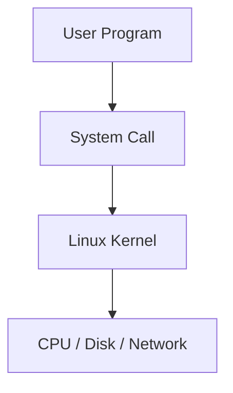
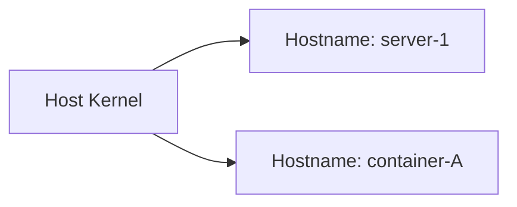
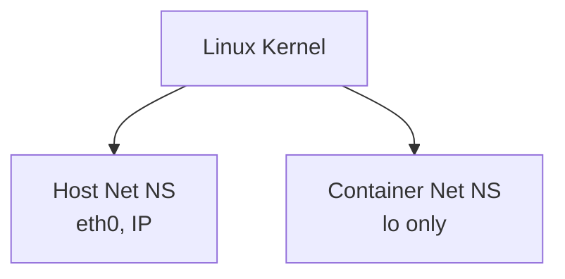
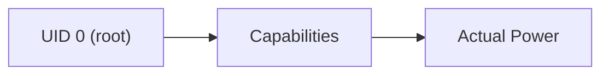
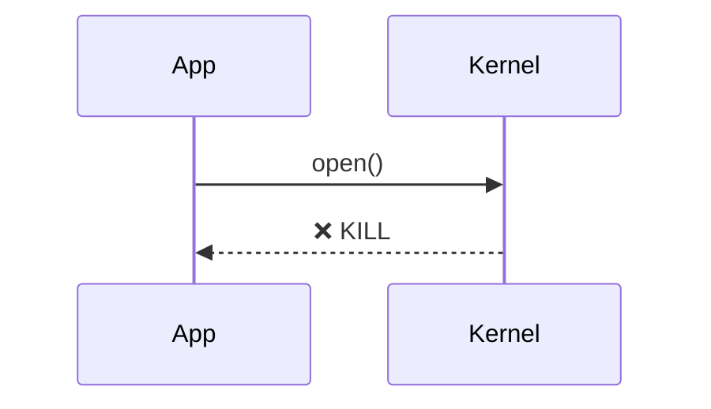
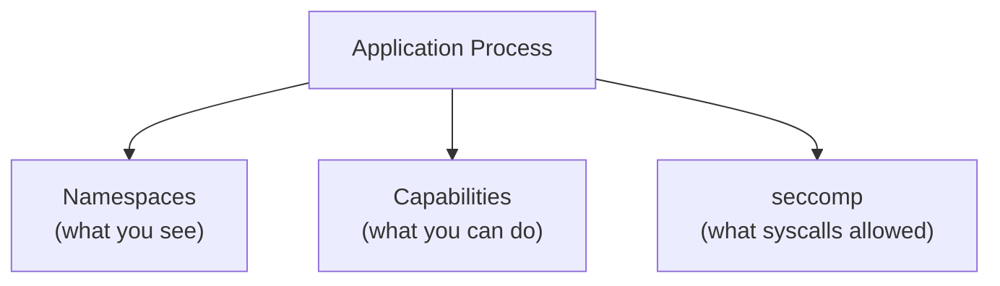

# Linux Container Isolation Internals  
## Namespaces, PID 1, Capabilities, and seccomp (Hands-on Notes)

> This document captures **Linux kernel–level isolation mechanisms** exactly as explored
> through hands-on experiments on Ubuntu.
>  
> Scope:
> - Namespaces (PID, UTS, NET)
> - Why PID 1 matters
> - Linux capabilities
> - seccomp (system call filtering)
> - What system calls actually are
>
> Docker and Kubernetes **assemble these primitives** — they do not invent them.

---

## 1. Linux Processes and System Calls (Foundation)

### 1.1 What a Process Can and Cannot Do

A Linux process:
- Runs in **user space**
- Cannot directly access hardware or kernel memory
- Must ask the kernel for everything

The only way a process talks to the kernel is via **system calls (syscalls)**.

---

### 1.2 What Is a System Call

A **system call** is a controlled entry point into the kernel.

Examples:
- `open()` → open a file
- `read()` → read data
- `write()` → write data
- `fork()` → create a process
- `execve()` → start a new program
- `mount()` → mount filesystem
- `kill()` → send signal

No matter the language (C, Python, Java, Bash):
- Everything eventually becomes syscalls.



**Key rule:**  
If a syscall is blocked, the kernel operation is impossible.

---

## 2. Namespaces — Isolation by Visibility

Namespaces answer:
> “What does this process see?”

They do **not** control power — only visibility.

---

### 2.1 PID Namespace (Process Isolation)

PID namespaces give a process:
- Its own process ID space
- Its own PID 1

Inside a PID namespace:
- The first process becomes PID 1
- Host processes are invisible

```mermaid
graph TD
    HostInit["systemd (PID 1 on host)"]
    HostP["Other host processes"]
    SubgraphNS["PID Namespace"]
    NSInit["bash (PID 1 in namespace)"]
    NSChild["child process"]
    end
    HostInit --> HostP
    NSInit --> NSChild
```

---

### 2.2 Why PID 1 Matters

PID 1 is special because the kernel expects it to:
- Reap orphaned (zombie) processes
- Handle shutdown signals
- Control lifecycle of the system

In containers:
- Your application often becomes PID 1
- Most applications are **not designed** for this role

Consequences:
- Zombie processes
- Hanging containers
- Broken shutdowns

---

### 2.3 UTS Namespace (Hostname Isolation)

UTS namespace isolates:
- Hostname
- NIS domain name

Each container:
- Thinks it has its own hostname
- Even though the kernel is shared



---

### 2.4 Network Namespace (Network Isolation)

Network namespaces isolate:
- Interfaces
- IP addresses
- Routing tables
- Ports

Each container gets:
- Its own network stack



This allows:
- Multiple containers to bind port 80
- No port conflicts

---

## 3. Linux Capabilities — Isolation by Power

Namespaces hide things.
Capabilities limit **what even root can do**.

---

### 3.1 Why Capabilities Exist

Old Linux:
- root = unlimited power ❌

Modern Linux:
- root power split into **capabilities**

Examples:
- `CAP_NET_ADMIN` → configure networking
- `CAP_SYS_ADMIN` → mount filesystems
- `CAP_KILL` → signal other processes

Root = UID 0 **plus a set of capabilities**

---

### 3.2 Root Without Capabilities

A process can:
- Have UID 0 (root)
- But lack critical capabilities



Containers run as:
- root
- with **many capabilities removed**

This is why:
> root inside container ≠ root on host

---

## 4. seccomp — Isolation by Syscall Filtering

seccomp answers:
> “Which syscalls may this process execute?”

This is the **strongest isolation layer**.

---

### 4.1 Why seccomp Is Needed

Even if:
- Process is root
- Capability exists

Kernel operations still require syscalls.

seccomp allows the kernel to:
- Allow
- Deny
- Kill
a process based on syscall usage.

---

### 4.2 seccomp Strict Mode (Concept)

In strict mode:
- Only 4 syscalls allowed:
  - `read`
  - `write`
  - `exit`
  - `sigreturn`

Any other syscall:
- Process is killed instantly



---

### 4.3 seccomp in Containers

Docker applies a **default seccomp profile**:
- Allows normal application syscalls
- Blocks dangerous ones:
  - `mount`
  - `ptrace`
  - `kexec`
  - `reboot`

Even if:
- Capability exists
- Process is root

Kernel still denies the syscall.

---

## 5. How All Isolation Layers Work Together



---

## 6. Final Mental Model (Critical)

> Containers are not VMs.  
> Containers are **Linux processes** with:
> - Limited visibility (namespaces)
> - Limited power (capabilities)
> - Limited kernel access (seccomp)

Docker and Kubernetes simply:
- Apply these rules consistently
- Automate them at scale

---

## 7. One-Sentence Summary

> **If a process cannot see it, cannot do it, and cannot syscall it — it cannot break out.**
