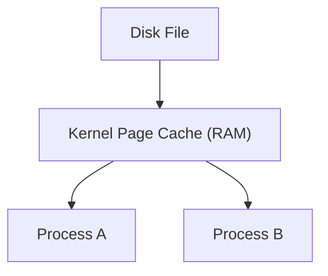
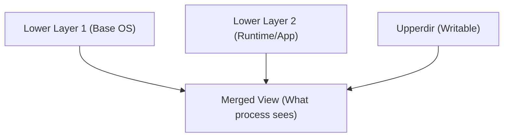
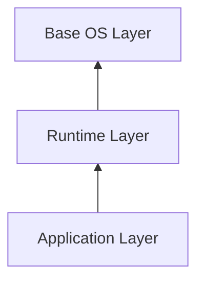
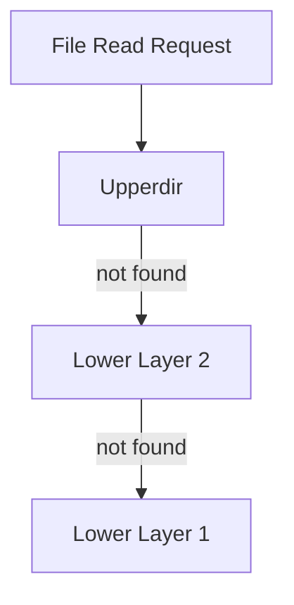
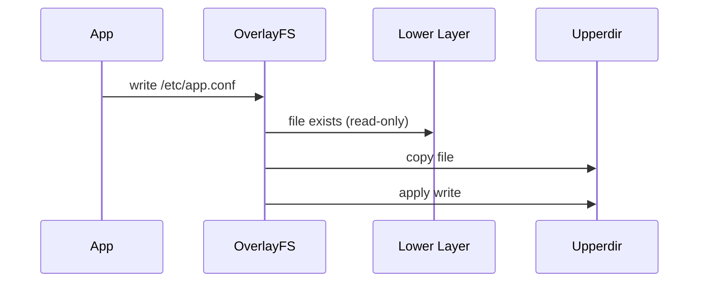
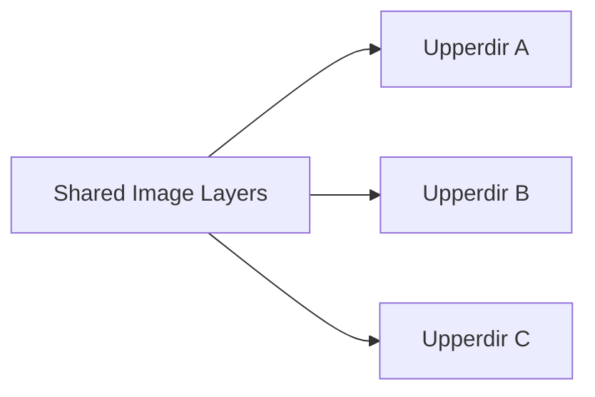

# Docker Filesystem Internals — Linux Hands-on Learning Notes

> This document is written as a **terminal-first engineering notebook**.
> Everything here is derived from **hands-on experiments on Ubuntu Linux**.
> No Docker abstractions are assumed — only Linux kernel behavior.

---

## 1. Linux Filesystem Fundamentals

### 1.1 What a File Is in Linux

A file in Linux consists of:
- **inode** → metadata (permissions, owner, size, pointers)
- **data blocks** → actual content on disk

Processes do **not** read directly from disk every time.

Instead:
- Kernel loads file blocks into **page cache (RAM)**
- All processes read from that shared cache

---

### 1.2 Page Cache (Critical Concept)

- Global across the system
- Indexed by `(inode, offset)`
- Shared by all processes
- Read-only unless a write occurs

**Key takeaway:**  
One file → one disk copy → one memory copy → many readers.

---

## 2. Why Containers Can Share Files Safely

### 2.1 Shared Reads Are Normal in Linux

Linux has always allowed:
- Multiple processes
- Reading the same file
- At the same time
- Without conflicts

This behavior existed **long before Docker**.

---

### 2.2 The Real Problem Containers Solve

In real-world systems:
- Hundreds of services
- Same OS libraries
- Same runtimes (Java, Python, Node)
- Only application code differs

Copying the full filesystem per container would be:
- Disk-expensive
- Slow
- Impossible at scale

---

## 3. OverlayFS — The Core Mechanism

OverlayFS is a **union filesystem**.
It merges multiple directories into **one logical filesystem view**.

---

### 3.1 OverlayFS Components

| Component | Purpose |
|---------|--------|
| lowerdir | Read-only image layers |
| upperdir | Writable container layer |
| workdir | Kernel internal workspace |
| merged  | Final filesystem view |

---

### 3.2 OverlayFS Architecture

---

## 4. Why There Are Multiple Lower Layers

Lower layers exist to enable **reuse and caching**.

Different layers change at different frequencies:

| Layer | Change Rate |
|-----|------------|
| Base OS | Rare |
| Runtime | Occasional |
| Application | Frequent |

**Benefits:**
- Faster builds
- Smaller images
- Shared disk usage
- Shared memory usage

---

## 5. Why Layer Order Matters

OverlayFS lookup order:

1. upperdir
2. top lower layer
3. next lower layer
4. base layer

Upper layers **override** lower layers.

This explains:
- Dockerfile instruction order
- Cache invalidation
- Override behavior

---

## 6. Why the Upperdir Exists

Image layers are **immutable** because:
- They are shared
- Modifying them would affect other containers

But applications must still:
- Write logs
- Create temp files
- Modify configs at runtime

### Solution: upperdir

Each container gets:
- One private writable layer
- Deleted when container is removed

---

## 7. Copy-on-Write (The Most Important Concept)

### Scenario
A file exists only in a lower layer.
A container tries to modify it.

### Kernel Behavior
1. Lower layer is read-only
2. Kernel copies file into upperdir
3. Write happens only there
4. Other containers are unaffected

---

## 8. Why Containers Are Cheap and Images Are Shared

### Disk Sharing
- Image layers stored once
- Containers add only a small upperdir

### Memory Sharing
- Page cache shared
- Same image files mapped into memory once

---

## 9. Why Containers Are Ephemeral

Deleting a container means:
- Deleting its upperdir

Image layers:
- Remain untouched
- Cached
- Reusable instantly

This is why:
- Containers should not store state
- Volumes and external storage exist

---

## 10. Final Mental Model

> A container is **not** a filesystem copy.  
> A container is a **writable layer on top of shared, read-only image layers**.

Once this is understood:
- Dockerfiles make sense
- Image size optimization makes sense
- Kubernetes storage rules make sense
