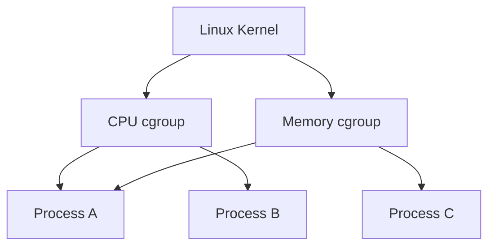
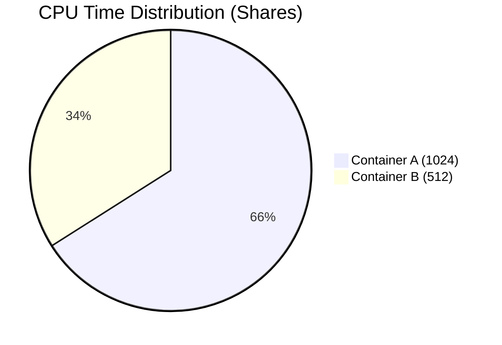
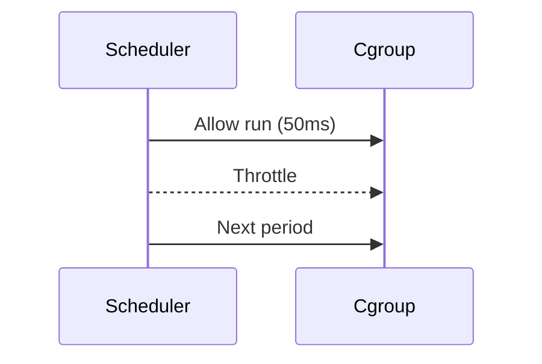
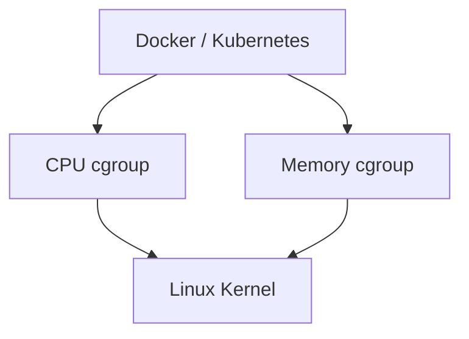

# Linux cgroups Deep Dive  
## CPU & Memory Internals (Container Resource Control)

> This document explains **control groups (cgroups)** from first principles,
> focusing on **CPU and memory internals**, exactly as used by Docker and Kubernetes.
>
> Scope:
> - Why cgroups exist
> - CPU cgroups (shares, quotas, throttling)
> - Memory cgroups (limits, OOM, reclaim)
> - How containers really get “resource limits”
>
> This is a **kernel-level explanation**, not a Docker tutorial.

---

## 1. Why cgroups Exist (The Real Problem)

Linux is a **multi-process system**.
Without control, one process can:
- Consume all CPU
- Consume all memory
- Crash the entire system

Before cgroups:
- Nice values were advisory
- No hard memory limits
- One bad process could kill the host

### cgroups answer one question:

> “How much of a resource is this group of processes allowed to use?”

---

## 2. What cgroups Are (Foundational Model)

A **cgroup** is:
- A kernel construct
- That groups processes
- And applies **resource limits** to the group

Key idea:
> Limits apply to **groups**, not individual processes.

Containers are just:
- Processes
- Placed inside cgroups

---

## 3. cgroups Architecture (Conceptual)

A process can belong to:
- One CPU cgroup
- One memory cgroup
(simultaneously)

---

## 4. CPU cgroups — How CPU Is Controlled

CPU is:
- Not consumed
- But **scheduled over time**

cgroups control:
- **Who gets CPU time**
- **How much**
- **When throttling happens**

---

## 5. CPU Shares (Relative Weight)

### What CPU shares mean

CPU shares are **relative weights**, not limits.

Example:
- Container A: 1024 shares
- Container B: 512 shares

Result:
- A gets ~2× CPU compared to B
- Only when CPU is contended

Important:
- If CPU is idle → everyone can use more
- Shares matter only under contention

---

## 6. CPU Quotas (Hard Limits)

CPU quotas enforce **hard caps**.

Defined by:
- `cpu.cfs_quota_us`
- `cpu.cfs_period_us`

Example:
- Period = 100ms
- Quota = 50ms

Meaning:
> This cgroup can run for 50ms every 100ms (≈ 0.5 CPU)

If quota is exceeded:
- Kernel **throttles** processes
- They are paused until next period

---

## 7. CPU Throttling (What Apps Feel)

When throttled:
- Application feels “slow”
- No errors
- Just less CPU time

This explains:
- Latency spikes
- Throughput drops
- “CPU looks idle but app is slow”

---

## 8. Memory cgroups — How Memory Is Controlled

Memory is:
- Finite
- Shared
- Dangerous when exhausted

Memory cgroups provide:
- Hard memory limits
- Accounting
- OOM isolation

---

## 9. Memory Limits (Hard Wall)

Each cgroup can have:
- `memory.limit_in_bytes`

When usage exceeds limit:
- Kernel triggers **OOM inside the cgroup**
- NOT host-wide OOM

This is why:
- Containers get OOMKilled
- Host survives

---

## 10. Memory Reclaim (Before OOM)

Before killing:
Kernel tries:
- Page reclaim
- Cache eviction

If reclaim fails:
- OOM killer activates

Important:
- Some memory is unreclaimable
- Sudden spikes can still OOM

---

## 11. OOM Killer Behavior (Critical)

When OOM happens:
- Kernel selects a victim
- Based on:
  - Memory usage
  - oom_score
- Kills the process

In containers:
- Kill happens **inside the cgroup**
- Other containers unaffected

---

## 12. CPU vs Memory — Key Difference

| Resource | Behavior |
|-------|---------|
| CPU | Throttled |
| Memory | Killed |

This is fundamental.

---

## 13. How Containers Use cgroups

Docker/K8s:
- Do not limit resources themselves
- They **configure cgroups**

---

## 14. Kubernetes Mapping (Conceptual)

| Kubernetes | cgroup |
|---------|--------|
| cpu request | cpu shares |
| cpu limit | cpu quota |
| memory limit | memory limit |

This explains:
- Burstable pods
- Guaranteed QoS
- OOM behavior

---

## 15. Common Production Pitfalls

### CPU limits too low
- Throttling
- Latency spikes

### Memory limits too tight
- OOMKilled
- Crash loops

### No limits
- Noisy neighbor
- Node instability

---

## 16. Final Mental Model (Lock This In)

> cgroups do not virtualize resources.  
> They **police access** to real resources.

- CPU → scheduled slices
- Memory → hard walls

---

## 17. One-Sentence Summary

> cgroups are the kernel’s traffic police, deciding who gets how much CPU time and memory, and killing processes when limits are crossed.
