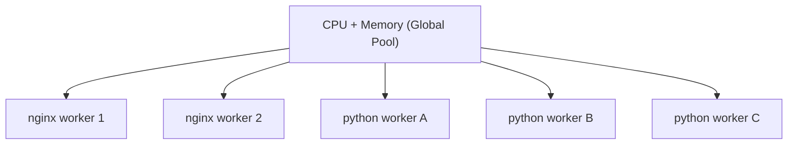
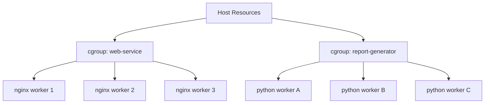
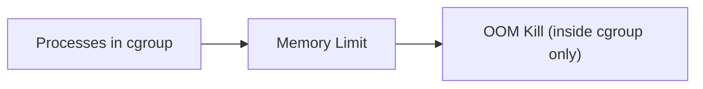
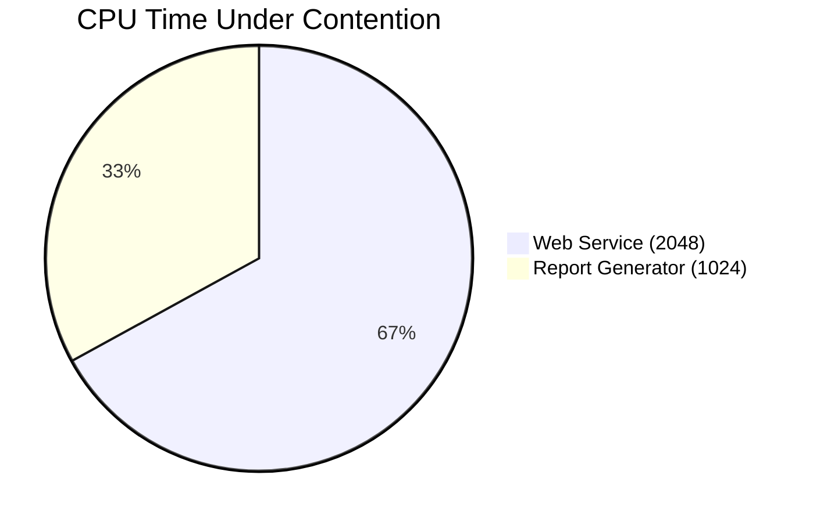
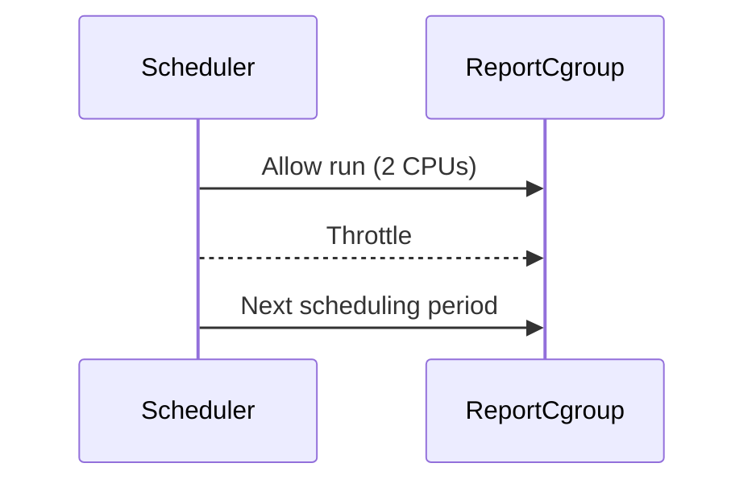
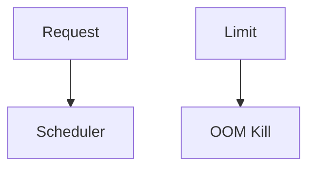

# Linux cgroups — Why They Exist & How They Work  
## A Diagram-First, Real-World Explanation

> This document explains **why cgroups exist**, using **one concrete Linux example**  
> and building the mental model step by step with diagrams.
>
> Focus:
> - The real Linux problem
> - What a *group of processes* means
> - CPU & memory control
> - Requests vs limits
> - Why failure containment matters
>
> This is **Linux-first**, not Docker-first.

---

## 1. The Real Linux Problem (Before cgroups)

### One Machine, Multiple Workloads

Assume one Linux server:
- 8 CPU cores
- 16 GB RAM

Two workloads run on it:

1. **Web Service** (latency-sensitive)
2. **Report Generator** (batch, heavy)

---

## 2. What “Group of Processes” Means

A workload is **never a single process**.

### Web Service
```
nginx
 ├─ worker 1
 ├─ worker 2
 ├─ worker 3
 └─ logger
```

### Report Generator
```
python main.py
 ├─ worker A
 ├─ worker B
 ├─ worker C
 └─ helper
```

👉 Linux needs to manage **these trees as units**.

---

## 3. Linux Without cgroups (Failure Case)

### How Linux Used to See the System



No ownership.  
No fences.

---

## 4. What Goes Wrong (Single Bug Example)

Report generator:
- Spawns more workers
- Allocates memory aggressively

Result:
1. Memory exhaustion
2. Global OOM killer triggers
3. Random process killed
4. Often nginx or ssh dies

💥 **Whole machine destabilized**

---

## 5. What Linux Was Missing

Linux could answer:
- “Which process used memory?”

But **not**:
> “Which workload should suffer?”

There was no **responsibility boundary**.

---

## 6. Enter cgroups (control groups) — The Core Idea

cgroups allow Linux to say:

> “These processes belong together.  
> Apply limits and accounting to the group.”

---

## 7. Same System With cgroups

### Define Two cgroups

- `cgroup: web-service`
- `cgroup: report-generator`



Now Linux understands **ownership**.

---

## 8. Memory cgroups — Failure Containment

### Assign Memory Limits

- web-service → 4 GB
- report-generator → 8 GB



### Result

- Report generator exceeds 8 GB
- Kernel kills python process
- nginx survives
- Host stays healthy

🎯 **Failure is contained**

---

## 9. CPU cgroups — Fairness Under Load

### CPU Shares (Relative Weight)

- web-service → 2048 shares
- report-generator → 1024 shares



Meaning:
- Web service gets priority
- Batch job still progresses
- No starvation

---

## 10. CPU Quotas — Hard Limits

Example:
- report-generator → max 2 CPUs



CPU is throttled, not killed.

---

## 11. CPU vs Memory (Critical Difference)

| Resource | What Happens at Limit |
|--------|-----------------------|
| CPU | Throttled |
| Memory | Process killed |

This explains:
- Latency under CPU limits
- Crash loops under memory limits

---

## 12. Why Requests and Limits Exist

### CPU

- **Request** → expected usage (shares)
- **Limit** → hard cap (quota)

### Memory

- **Request** → scheduling hint
- **Limit** → absolute wall



---

## 13. Why Containers & Kubernetes Need cgroups

Containers provide:
- Isolation (namespaces)

But without cgroups:
- Any container could kill the host

cgroups provide:
- Fairness
- Containment
- Predictability

---

## 14. Final Mental Model (Lock This In)

> A **group of processes** is a workload.  
> cgroups let Linux:
> - Assign ownership
> - Enforce fairness
> - Contain failure  
> at the workload level.

---

## 15. One-Sentence Summary

> cgroups exist because Linux needed a way to ensure that when a workload misbehaves, *only that workload pays the price*.
