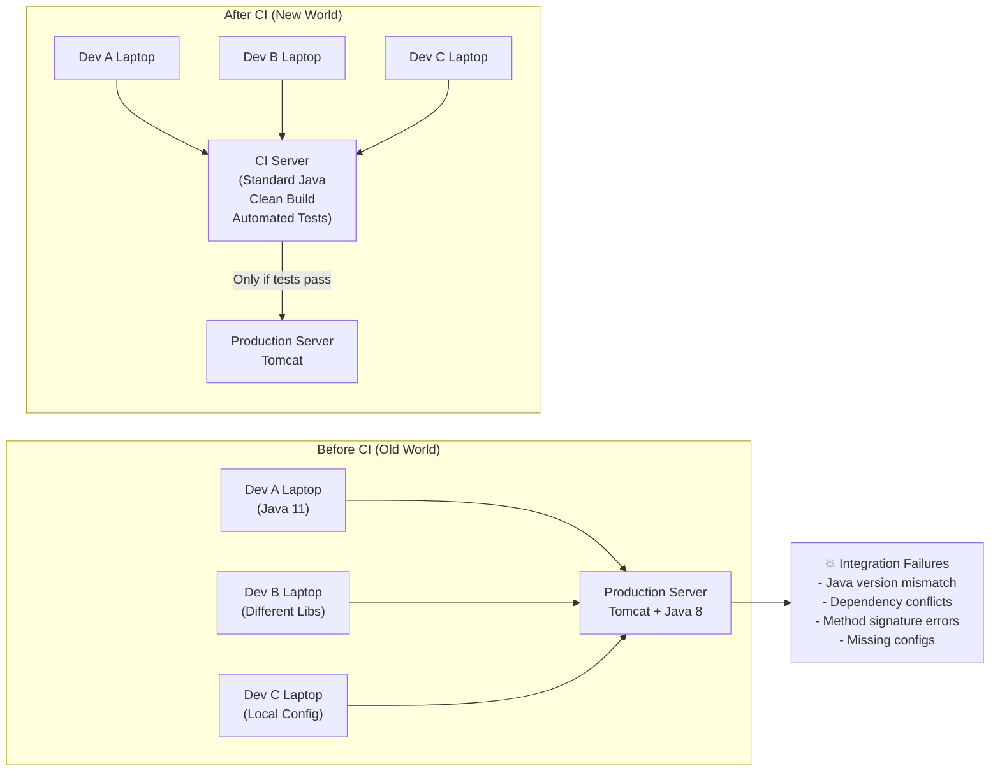

```mermaid
flowchart LR
    %% ===== PRE-CI WORLD =====
    subgraph PRE_CI["Before CI (Old World)"]
        DevA["Dev A Laptop\n(Java 11)"]
        DevB["Dev B Laptop\n(Different Libs)"]
        DevC["Dev C Laptop\n(Local Config)"]

        DevA --> Prod["Production Server\nTomcat + Java 8"]
        DevB --> Prod
        DevC --> Prod
    end

    %% ===== ISSUES =====
    Prod --> Issues["💥 Integration Failures\n- Java version mismatch\n- Dependency conflicts\n- Method signature errors\n- Missing configs"]

    %% ===== CI WORLD =====
    subgraph CI_WORLD["After CI (New World)"]
        DevA2["Dev A Laptop"]
        DevB2["Dev B Laptop"]
        DevC2["Dev C Laptop"]

        CI["CI Server\n(Standard Java\nClean Build\nAutomated Tests)"]

        DevA2 --> CI
        DevB2 --> CI
        DevC2 --> CI

        CI -->|Only if tests pass| Prod2["Production Server\nTomcat"]
    end
```