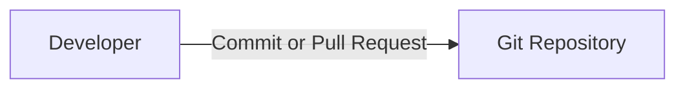
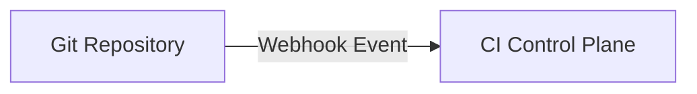
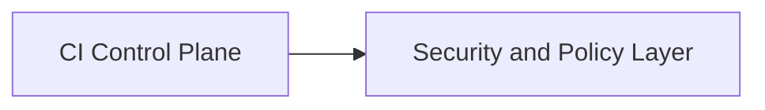
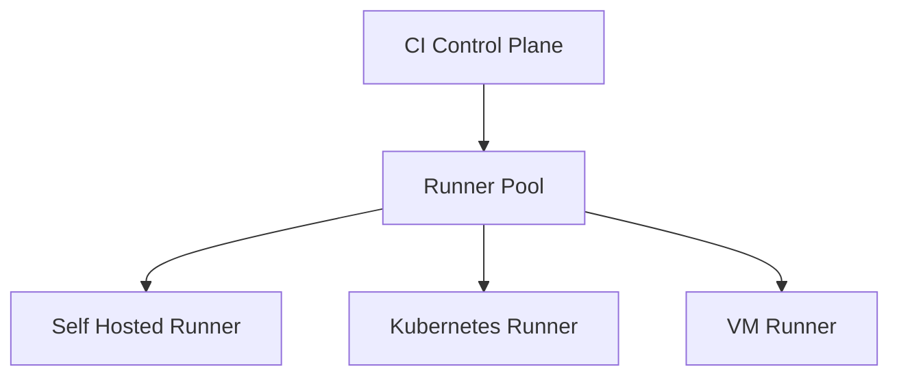
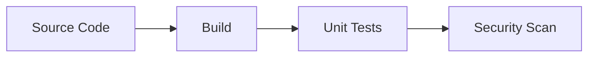
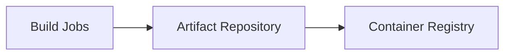
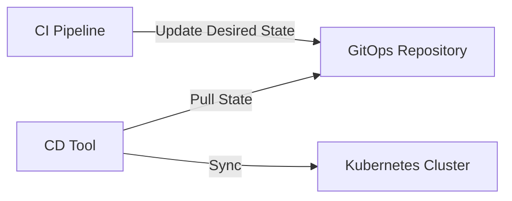
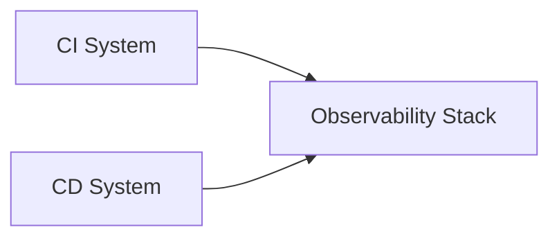

# CI/CD Architecture – Enterprise / SAP Scale

## Introduction

At enterprise scale, Continuous Integration and Continuous Delivery (CI/CD) is **not a simple pipeline**.
It is a **distributed, event-driven, multi-tenant platform** that must operate with the same rigor as any
production system.

This document explains CI/CD architecture **layer by layer**, with a strong focus on:
- Scale (tens of thousands of developers)
- Security and isolation
- Reliability and observability
- Platform and SRE thinking (as expected at SAP)

All diagrams are written in **GitHub-compatible Mermaid syntax**.

---

## Layer 1: Source Layer (Git)

### Purpose
The Source Layer is the **single source of truth** for:
- Application code
- Infrastructure code
- Pipeline definitions
- Desired deployment state (GitOps)

### Responsibilities
- Version control
- Change history and audit trail
- Triggering CI/CD events
- Enforcing branch and merge policies

### Key Characteristics
- Event-driven (push, pull request, tag, manual trigger)
- Strong governance using branch protection
- Mandatory reviews and status checks

### Diagram

Why this matters at scale:
- Git events are the **only trusted trigger**
- Everything downstream depends on Git integrity

---

## Layer 2: CI Control Plane

### Purpose
The CI Control Plane acts as the **brain** of the CI system.

Examples:
- GitHub Actions
- Jenkins
- GitLab CI

### Responsibilities
- Parse pipeline definitions
- Schedule jobs
- Enforce permissions
- Manage secrets and identities
- Coordinate runners

### What the Control Plane Does NOT Do
- It does not build code
- It does not run tests
- It does not deploy workloads

Those responsibilities belong to the execution plane.

### Diagram

Key interview insight:
Control plane and execution plane must always be **logically and operationally separated**.

---

## Layer 3: Security and Policy Layer

### Purpose
This layer ensures that **only safe and authorized actions** are allowed to execute.

### Responsibilities
- Identity and access control
- Secret management
- Policy enforcement
- Environment protection

### Common Controls
- OIDC-based short-lived credentials
- Role-Based Access Control (RBAC)
- Secret scoping per repository or environment
- Manual approvals for sensitive environments

### Diagram

Why SAP cares:
CI/CD is a **high-value attack surface**.
Compromising pipelines can compromise the entire company.

---

## Layer 4: Runner / Execution Plane

### Purpose
The execution plane is where **actual compute work happens**.

### Runner Types
- Self-hosted runners
- Kubernetes-based ephemeral runners
- VM-based runners

### Responsibilities
- Checkout code
- Run builds and tests
- Execute scans
- Package artifacts

### Design Principles
- Runners must be disposable
- Jobs must be stateless
- No shared mutable state
- Horizontal scalability

### Diagram

SRE mindset:
Runners are cattle, not pets.

---

## Layer 5: CI Job Lifecycle (Build, Test, Scan)

### Purpose
This layer validates changes **before they reach production**.

### Typical Steps
- Dependency resolution
- Build
- Unit tests
- Static analysis
- Security scanning

### Key Goals
- Fast feedback
- Deterministic results
- Early failure detection

### Diagram

Key idea:
CI optimizes for **speed and signal**, not completeness.

---

## Layer 6: Artifact and Image Management

### Purpose
Artifacts are the **output of CI** and the **input of CD**.

### Examples
- JAR files
- ZIP bundles
- Container images

### Key Properties
- Immutable
- Versioned
- Promoted across environments

### Why This Layer Is Critical
- Enables rollback
- Prevents environment drift
- Decouples build from deploy

### Diagram

Golden rule:
**Never rebuild the same artifact for different environments.**

---

## Layer 7: CD Layer (Continuous Delivery)

### Purpose
The CD layer is responsible for **safe change propagation**.

### Responsibilities
- Environment promotion
- Deployment orchestration
- Rollback handling
- Release visibility

### Two CD Models

#### Push-Based CD
- CI pushes changes directly
- CI holds cluster credentials
- High blast radius

#### Pull-Based CD (GitOps)
- CI updates desired state in Git
- CD system pulls changes
- Strong audit and security

### Diagram (GitOps Model)

SAP-scale systems strongly prefer **GitOps**.

---

## Layer 8: Target Runtime (Kubernetes)

### Purpose
This layer runs the actual application workloads.

### Responsibilities
- Enforce desired state
- Self-heal workloads
- Scale applications
- Expose services

### Why Kubernetes Fits CI/CD
- Declarative model
- Strong reconciliation loop
- Works naturally with GitOps

CI/CD never directly mutates runtime state.
It declares intent.

---

## Layer 9: Observability Layer

### Purpose
CI/CD must be treated as a **production system**.

### What to Observe
- Pipeline duration
- Failure rates
- Runner utilization
- Deployment success

### Diagram

If CI/CD is down, developer productivity stops.

---

## Layer 10: Failure Modes and Controls

### Common Failure Scenarios
- Runner exhaustion
- Long queue times
- Flaky builds
- Partial deployments
- Secret leakage

### Architectural Controls
- Auto-scaling runners
- Concurrency limits
- Immutable artifacts
- Git-based rollback
- Monitoring and alerts

---

## Interview-Ready Summary

CI/CD at enterprise scale is a layered distributed platform where:
- Git is the source of truth
- A control plane orchestrates work
- Runners execute isolated jobs
- Artifacts are immutable
- CD follows a pull-based GitOps model
- Security and observability are first-class

This architecture enables scale, reliability, and developer productivity.
