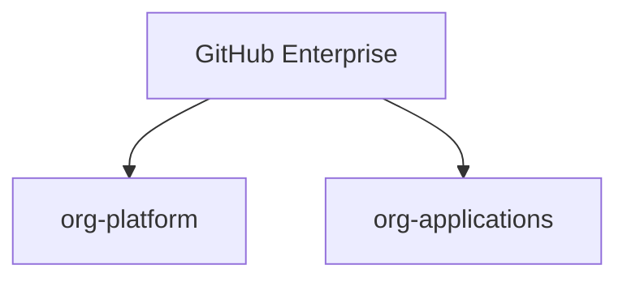

# Enterprise CI/CD Project – GitHub Actions + OIDC + Kubernetes (Hands-on)

## Project Context

You have joined a large enterprise (SAP-like) as a **Senior Platform / DevOps Engineer**.

The company has:
- GitHub Enterprise
- Multiple GitHub Organizations
- Azure / GCP cloud
- Kubernetes as runtime
- GitHub Actions as CI/CD standard

Your responsibility is to **build a secure, scalable CI/CD platform** that thousands of developers can use safely.

---

## 1. GitHub Enterprise and Organization Structure

### Enterprise
- SSO and identity
- Audit logs
- Global policies

### Organizations



---

## 2. Platform vs Application Responsibility

Platform team:
- Owns reusable workflows
- Owns runners
- Enables OIDC
- Defines environments

Application teams:
- Own app repos
- Use platform workflows
- Never handle cloud credentials

---

## 3. Repository Structure

Platform repo:

```
org-platform/.github/workflows/
  ├── ci-build.yml
  ├── docker-build.yml
  └── deploy-k8s.yml
```

---

## 4. Before OIDC – Secret-Based Authentication


Example workflow:

```yaml
- name: Cloud Login
  run: |
    az login       --service-principal       -u ${{ secrets.AZ_CLIENT_ID }}       -p ${{ secrets.AZ_CLIENT_SECRET }}
```

---

## 5. After OIDC – Identity-Based Authentication


No cloud secrets stored.

---

## 6. OIDC Setup Responsibility

Cloud Admin:
- Registers GitHub as OIDC provider
- Creates trust rules

Platform Team:
- Enables id-token permission
- Enforces environments

---

## 7. Reusable Deployment Workflow

```yaml
permissions:
  contents: read
  id-token: write

jobs:
  deploy:
    environment: prod
    steps:
      - uses: azure/login@v2
```

---

## 8. Application Workflow Usage

```yaml
jobs:
  deploy:
    uses: org-platform/.github/workflows/deploy-k8s.yml@v1
    with:
      environment: prod
```

---

## 9. Environments

- dev
- staging
- prod

Prod requires approval and OIDC.

---

## 10. End-to-End Flow

1. Code merged
2. Approval
3. OIDC token issued
4. Cloud access
5. Kubernetes deploy

---

## 11. Ownership Summary

| Area | Owner |
|-----|------|
| Enterprise | Security |
| Org | Platform |
| IAM | Cloud Admin |
| App CI | Dev Teams |

---

## Final Note

This model removes secrets, enforces identity, and scales safely.
