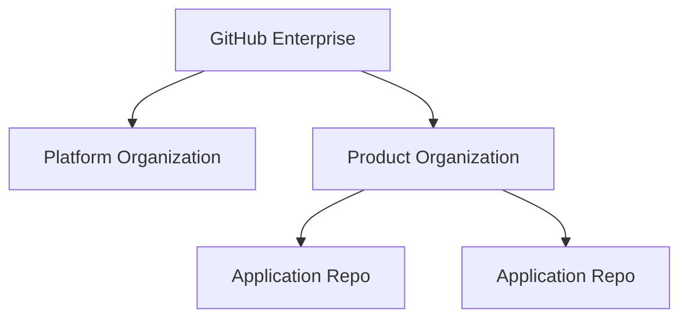
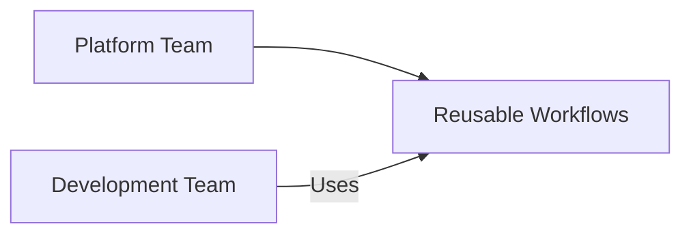
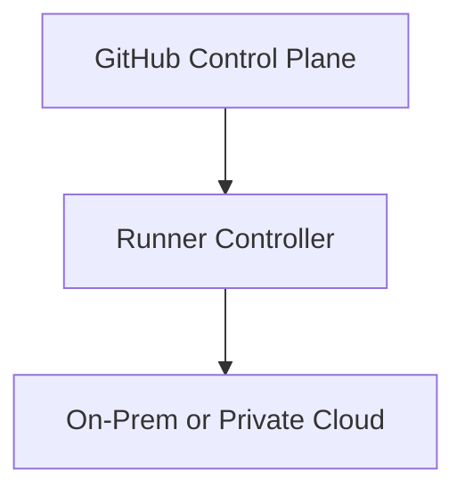
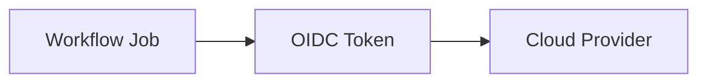
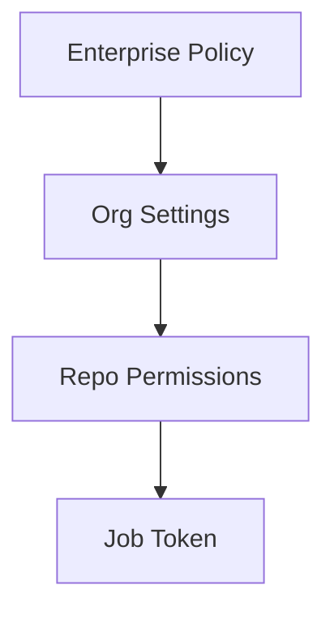
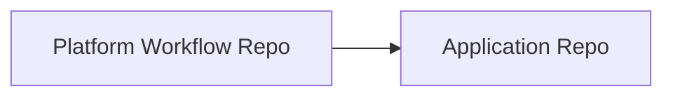

# GitHub Actions – Enterprise, Organization, and Platform Model (SAP-Scale)

## Fast Memory Map (2-Minute Revision)

- Enterprise = governance and policy
- Organization = enablement and shared services
- Repository = application pipelines
- Platform team = CI/CD builders
- Dev teams = CI/CD consumers
- OIDC = identity, no secrets

---

## 1. GitHub Enterprise Structure

### Hierarchy
1. GitHub Enterprise Account
2. Organizations
3. Repositories

### Responsibilities

| Level | Responsibility |
|------|---------------|
| Enterprise | SSO, audit, global policies |
| Organization | Runners, workflows, access |
| Repository | Code and pipelines |



---

## 2. Platform Team vs Dev Teams

Platform teams provide CI/CD as a product.



Platform owns runners, security, templates.
Dev teams only configure inputs.

---

## 3. On-Prem and Self-Hosted Runners

Used for:
- Internal network access
- Compliance
- Cost control



---

## 4. OIDC Authentication Model

OIDC replaces static secrets.



Short-lived, identity-based access.

---

## 5. Workflow Syntax (What Devs Touch)

```yaml
name: CI
on:
  pull_request:

permissions:
  contents: read

jobs:
  build:
    runs-on: self-hosted
    steps:
      - uses: actions/checkout@v4
      - run: make build
```

Key memory:
Triggers, permissions, jobs.

---

## 6. Permissions Model

Permissions flow downward.



Least privilege is mandatory.

---

## 7. Reusable Workflows

Platform teams create standardized workflows.

```yaml
jobs:
  ci:
    uses: platform-org/.github/workflows/ci.yml@v1
    with:
      language: python
```



---

## 8. Access Control Summary

| Role | Access |
|------|-------|
| Platform Team | Enterprise and Org admin |
| Dev Lead | Repo admin |
| Developer | Repo write |
| CI Job | Scoped token |

---

## 9. Interview One-Liner

> In SAP-scale environments, GitHub Actions is governed at the enterprise level, enabled by platform teams using reusable workflows and shared runners, secured with OIDC-based identity, and consumed by development teams with least-privilege access.
