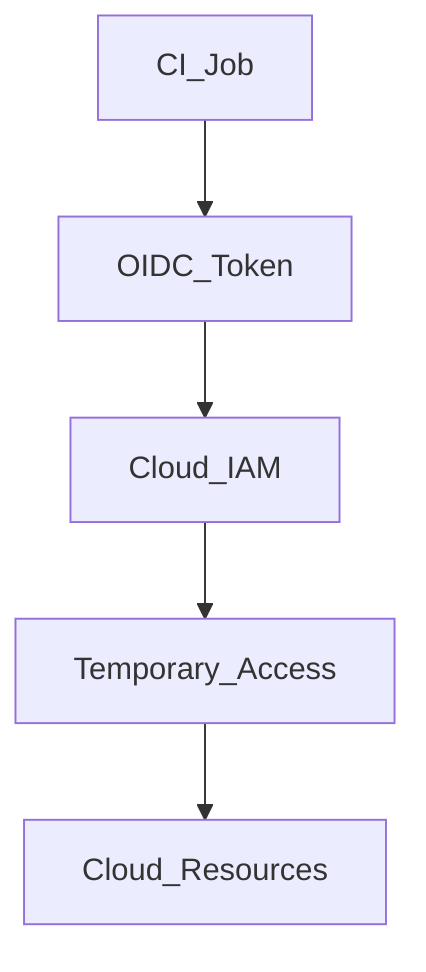
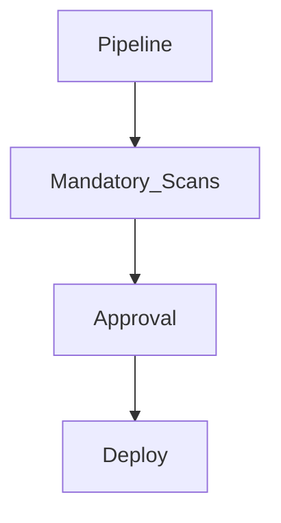
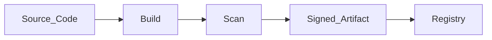
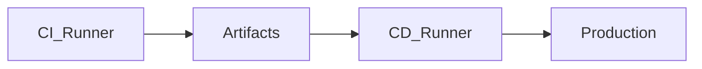

# CI/CD Security at SAP Scale – Internal Wiki

## Purpose
This wiki explains **how CI/CD security is designed at enterprise (SAP) scale**, where CI/CD systems are among the **most privileged systems in the company**.

Security here is **preventive by design**, not reactive.

---

## Core Principle (Burn This In)

> **CI/CD is the keys to the kingdom**

If CI/CD is compromised:
- Source code leaks
- Production access leaks
- Supply-chain attacks happen

So CI/CD security is designed on **zero trust + least privilege**.

---

## High-Level Security Layers (Memory Model)

```
Identity → Runners → Pipelines → Artifacts → Deployment
```

Every security control maps to one of these layers.

---

## 1. Identity & Authentication (OIDC – No Secrets)

### WHY this layer exists
Traditional CI/CD stored long-lived cloud credentials (keys, passwords). These are:
- Hard to rotate
- Easy to leak
- High blast radius

### WHAT modern CI/CD uses
- **OIDC (OpenID Connect)**
- Short-lived identity tokens

### HOW it works (simple)
1. CI job starts
2. CI provider issues short-lived identity token
3. Cloud verifies identity
4. Temporary access granted
5. Token expires automatically

### Diagram


### Failure if not used
- Static secrets leaked
- Manual secret rotation

---

## 2. Runner Security (Isolation is Mandatory)

### WHY runners are dangerous
Runners execute **untrusted code** (PRs).

If runners are shared or persistent:
- Secrets can leak
- Malicious code can persist

### WHAT secure runners look like
- Ephemeral (one job, then destroyed)
- Isolated per job
- No shared state

### HOW this is implemented
- Kubernetes-based ephemeral runners
- Separate runner pools for PR vs prod

### Diagram


---

## 3. Pipeline Security (Guardrails, Not Guidelines)

### WHY this layer exists
Developers should not decide whether security checks run.

### WHAT must be enforced
- Mandatory security scans
- Mandatory approvals
- Protected branches

### HOW it is implemented
- Reusable pipeline templates
- Branch protection rules
- Required status checks

### Diagram


---

## 4. Supply Chain Security (What You Build Matters)

### WHY this layer exists
Most modern attacks target dependencies, not source code.

### WHAT must be protected
- Base images
- Dependencies
- Build artifacts

### HOW it is implemented
- Trusted base images
- Dependency scanning (SCA)
- Image scanning (Trivy)
- Artifact signing

### Diagram


---

## 5. CI vs CD Security Separation (Critical)

### WHY separation is required
Build pipelines should **never** have production access.

### WHAT separation looks like
- CI runners: build & test only
- CD runners: deploy only

### HOW it is enforced
- Separate runner pools
- Separate identities
- Separate permissions

### Diagram


---

## 6. Environment & Approval Security

### WHY this layer exists
Production deployments must be intentional and auditable.

### WHAT is enforced
- Manual approvals for prod
- Environment-specific permissions

### HOW it is implemented
- Environment protection rules
- Required reviewers

---

## 7. Monitoring & Audit (Trust but Verify)

### WHY this layer exists
Security incidents must be detected quickly.

### WHAT is monitored
- Pipeline failures
- Unusual access patterns
- Deployment activity

### HOW it is implemented
- Audit logs
- Alerts
- SIEM integration

---

## Common Attack Scenarios & Defenses

### Malicious PR
- Runs on isolated runner
- No secrets available
- No prod access

### Credential leak
- No static credentials exist
- Tokens expire automatically

### Dependency poisoning
- Dependency scanning
- Signed artifacts

---

## Interview Summary (Memorize)

> CI/CD security at SAP scale is built on identity-based access using OIDC, ephemeral and isolated runners, mandatory security controls in pipelines, strong supply-chain protection, and strict separation between CI and CD permissions.

---

## One-Line Memory Formula

```
No secrets → No shared runners → No bypass → No trust by default
```

