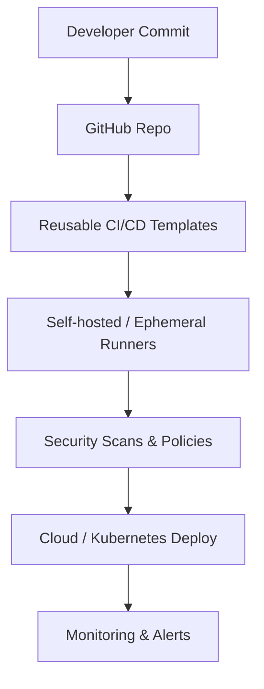
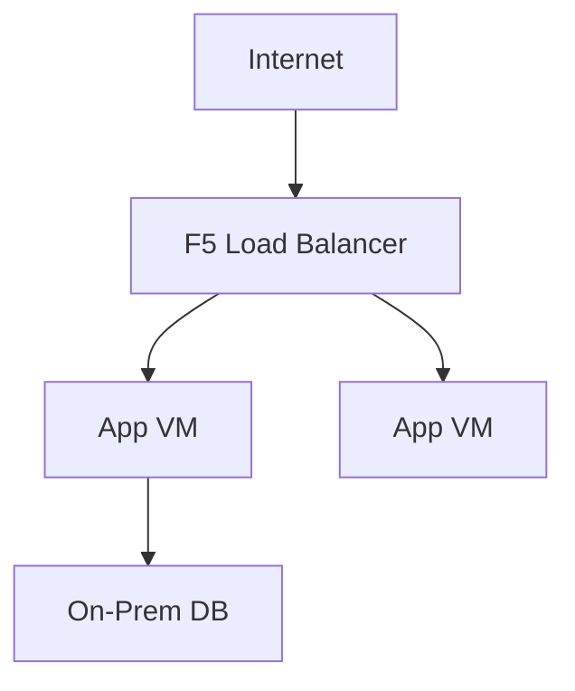
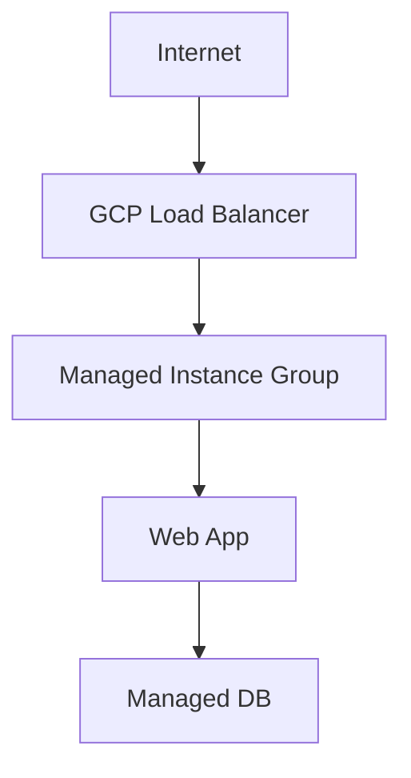

# Large-scale CI/CD Enablement & On-Prem to Cloud Migration

This document explains **how to enable large-scale CI/CD** and **how to automate on‑premises to cloud migration**, aligned with SAP’s Senior DevOps Engineer JD. It is written in interview-ready language with architectural thinking.

---

## 1. What “Large-scale CI/CD Enablement” Really Means

Large-scale CI/CD does **not** mean writing pipelines for one team.
It means building a **CI/CD platform** that thousands of developers can safely use without breaking security, reliability, or standards.

Key goals:
- Consistency across teams
- Security by default
- Self‑service for developers
- Minimal duplication
- Central governance with local flexibility

---

## 2. Platform vs DevOps Responsibilities

### Platform Engineering Team
- Owns CI/CD standards
- Builds reusable pipeline templates
- Manages runners
- Embeds security, compliance, monitoring

### Product / DevOps Teams
- Consume templates
- Configure environments
- Pass parameters (no custom scripts)
- Focus on application logic

**Mental model:**
> Platform builds the highway. DevOps teams drive on it.

---

## 3. CI/CD Architecture at Scale

---

## 4. Reusable CI/CD Templates

Templates are the **core enabler** of scale.

What goes into templates:
- Build logic
- Test stages
- Security scans (SAST, dependency scan)
- Deployment logic
- Monitoring hooks

Example pattern:
- One YAML line in product repo
- 30+ standardized steps behind the scenes

Developers **cannot bypass security**, because they don’t write the logic.

---

## 5. Runner Strategy

### GitHub-hosted Runners
- Zero maintenance
- Best for simple builds
- Higher cost at scale
- Limited customization

### Self-hosted Cloud Runners
- Full control
- Runs inside private network
- Can access internal services

### Ephemeral Self-hosted Runners (Recommended)
- Runner spins up per job
- Destroyed after job completes
- No leftover data
- Highly secure

---

## 6. Security at CI/CD Level

Security is **baked in**, not optional.

### Environment-level Security
- Dev / Stage / Prod environments
- Manual approvals for Prod
- Restricted deploy permissions

### Authentication
- OIDC for cloud access
- No static secrets
- IAM-based trust

### Policy Enforcement
- No privileged containers
- No root user
- Resource limits enforced

### Security Scanning
- SAST
- Dependency scanning
- Image vulnerability scans

---

## 7. Monitoring as Part of CI/CD

Monitoring is **not post-deploy work**.

Platform provides templates for:
- Metrics
- Logs
- Alerts

Developers only enable them via parameters.

---

## 8. Automating On-Prem to Cloud Migration

### What “Services” Mean
- Web applications
- Application servers
- Databases
- Storage
- Networking
- Kubernetes clusters

---

## 9. Migration Strategies

### Lift & Shift
- Move as-is
- Fast
- Minimal code changes

### Partial Modernization
- Keep core monolith
- Move smaller services

### Full Refactor
- Microservices
- Cloud-native

---

## 10. Example: Monolithic Web App → GCP

### Original On-Prem Setup

- Physical data center
- Purchased public IPs
- F5 load balancer
- Internal VLAN networking

---

### Cloud Migration Target (GCP)

Cloud replacements:
- F5 → Cloud Load Balancer
- VLAN → VPC
- Manual IP → Cloud public IP

---

## 11. Networking During Migration

- VPC mirrors on‑prem subnets
- Firewall rules replicate policies
- DNS gradually repointed
- Hybrid connectivity (VPN / Interconnect)

---

## 12. On-Prem Kubernetes → Managed Kubernetes

### On-Prem
- Self-managed control plane
- Manual upgrades
- High ops overhead

### Cloud
- GKE / AKS / EKS
- Managed control plane
- Auto-scaling

Migration steps:
- Move images to cloud registry
- Apply manifests via CI/CD
- Enforce policies

---

## 13. Why Automation Matters

Without automation:
- Manual errors
- Snowflake environments
- Slow recovery

With automation:
- Repeatable deployments
- Faster migration
- Auditability

---

## 14. Interview-ready Summary

> I enable large-scale CI/CD by building reusable templates, managing secure and scalable runners, enforcing security and governance by default, and automating both infrastructure and application delivery. For migrations, I automate on‑prem to cloud transitions using IaC, standardized networking patterns, and CI/CD-driven deployments, ensuring minimal downtime and consistent security.

---

## 15. How to Use This in Interview

- Start with **problem** (manual, inconsistent CI/CD)
- Explain **platform approach**
- Show **security-first thinking**
- Tie to **developer experience**
- Finish with **business impact**

---

End of document.

