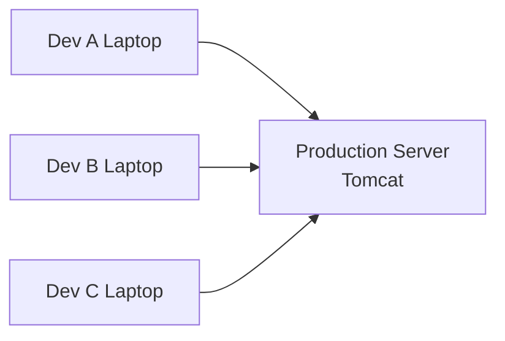
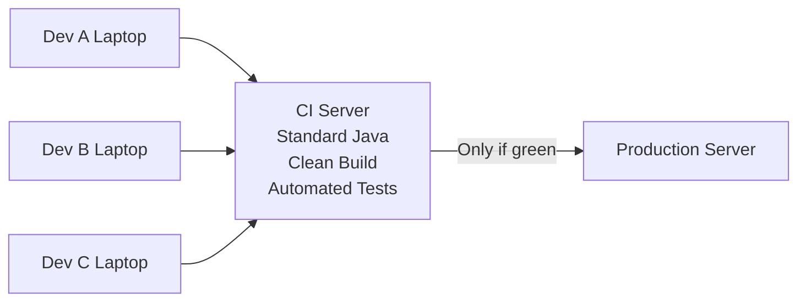

# Continuous Integration (CI) — One File to Remember Forever

This document is a **memory anchor**. If you understand and remember this file, CI will never feel confusing again.

---

## 1. The Real Problem CI Was Created To Solve

Before CI existed, companies had:

- Developers writing code on laptops
- Build / Release engineers creating artifacts
- Ops teams managing servers (Linux, Tomcat, Java)

The **core problem** was not bad developers or bad servers.

👉 The real problem was **integration happened too late**.

**Integration = the first time all code, dependencies, config, and runtime meet together.**

Before CI, that moment was **production**.

---

## 2. Before CI — Old World Flow



### What this means
- Each developer tested code in isolation
- Code was copied manually to production
- Production became the **first integration point**

This is why outages happened.

---

## 3. Common Integration Issues (Real Ones)

These problems **only appear when things combine**:

- Java version mismatch (Dev = Java 11, Prod = Java 8)
- Dependency version conflicts
- Method signature mismatches
- Missing or wrong config files
- Skipped build or test steps

These are called **integration issues** because:

> Individually everything works. Together it breaks.

---

## 4. Example — Java Version Mismatch

- Developer laptop: Java 11
- Production server: Java 8

Build succeeds locally.

Deployment fails in production:

```
UnsupportedClassVersionError
```

Why?
- Java bytecode versions differ
- Code is correct, environment is not

CI exists to catch this **before production**.

---

## 5. The Key Insight That Created CI

Someone finally asked:

> "Why are we trusting humans to remember critical steps?"

Answer:

> Let a machine build and test the code every time it changes.

That idea **is CI**.

---

## 6. After CI — New World Flow



### What changed
- CI became the **integration point**
- Everyone built in the same environment
- Broken code never reached production

---

## 7. What CI Actually Does

CI automates:

- Full build of combined code
- Tests on every change
- Verification in a clean environment

CI enforces:

- Same steps every time
- No skipped commands
- One source of truth (green build)

---

## 8. What CI Does NOT Do

CI does **not**:

- Deploy to production
- Manage servers
- Fix business logic bugs
- Understand requirements

CI only answers:

> "Is this combined codebase technically safe to proceed?"

---

## 9. Why It Is Called Continuous *Integration*

Because it continuously checks:

- Not individual code
- But the **integration of everything together**

CI moves integration from:

```
Production  ➜  CI Server
```

This single move changed software delivery forever.

---

## 10. One-Sentence Memory Rules

- **Before CI:** Production was the integration environment
- **After CI:** CI is the integration environment
- **CI exists:** To stop production from being the first place bugs meet

---

## 11. How DevOps Fits In

CI came first.

DevOps came later and said:

- Reduce handoffs
- Improve collaboration
- Automate more

But DevOps **depends on CI**.

CI is the spine. DevOps is the muscle.

---

## 12. Final Lock-In Statement

**Continuous Integration means: moving the first time everything runs together away from production.**

If you can explain that calmly, you understand CI at a senior level.

