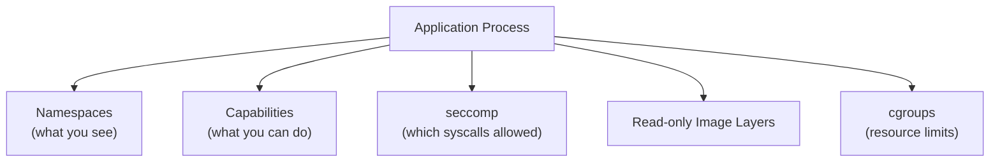
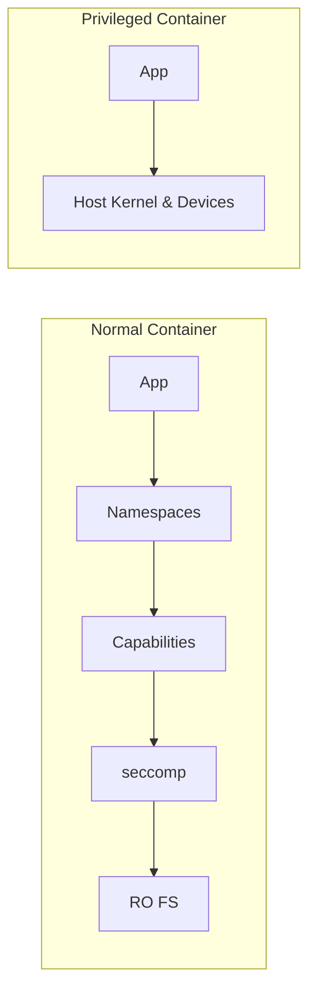
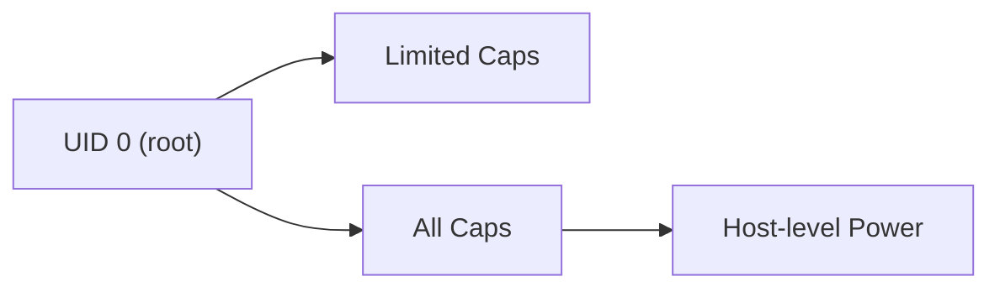
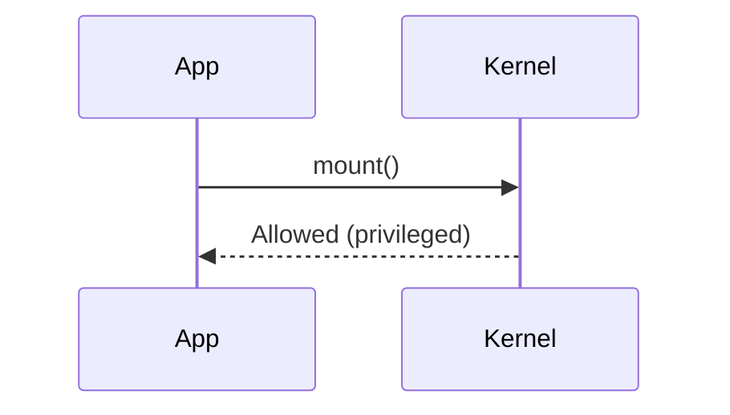
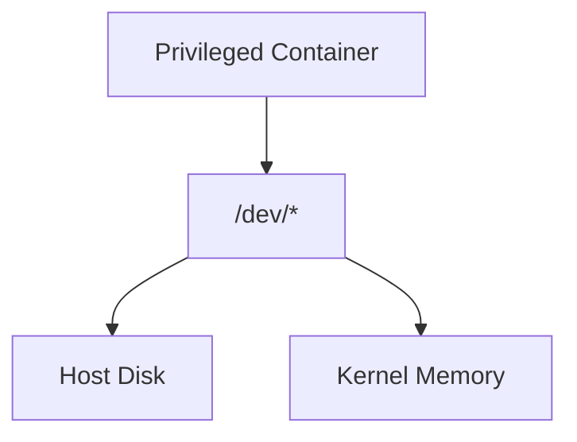
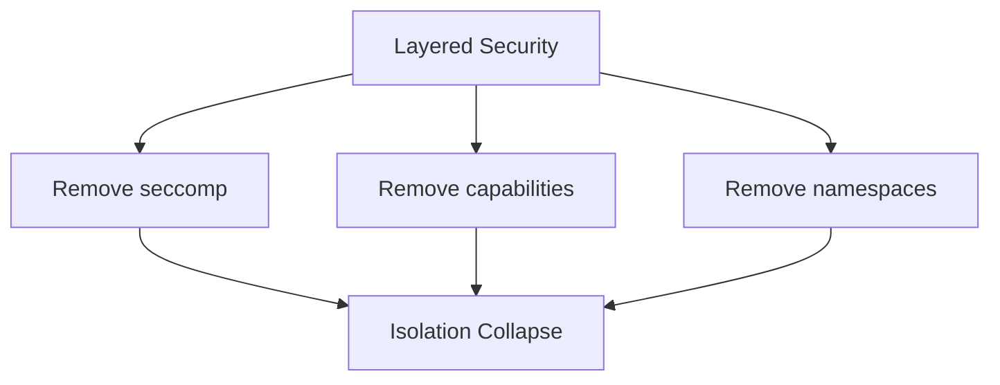

# Privileged Containers Explained  
## How a Single Flag Collapses Container Security

> This document explains **why privileged containers are dangerous**  
> by breaking down **exactly what the `--privileged` flag changes**  
> at the Linux kernel level.
>
> This is a **threat-model and mental-model document**, not a Docker tutorial.

---

## 1. Baseline: Why Containers Are Normally Safe

A normal container is safe **not because of one control**,  
but because of **multiple overlapping Linux protections**.

### Normal Container Security Layers

Each layer is **individually weak**.  
Together, they form **defense in depth**.

---

## 2. What “Privileged” Actually Means

The `--privileged` flag (or `securityContext.privileged: true`) is **not one change**.

It is a **bundle of security removals**.

### What Privileged Mode Does

| Security Control | Normal Container | Privileged Container |
|----------------|------------------|----------------------|
| Namespaces | Enabled | Partially relaxed |
| Linux capabilities | Many dropped | Almost all granted |
| seccomp | Enforced | Disabled |
| Device access | Restricted | Full `/dev/*` access |
| Kernel attack surface | Limited | Wide open |

---

## 3. Visual Comparison: Normal vs Privileged

---

## 4. Capabilities: The First Big Wall That Falls

### Normal Behavior
Root inside a container:
- Does NOT have `CAP_SYS_ADMIN`
- Cannot mount filesystems
- Cannot reconfigure host networking

### Privileged Behavior
Root gets:
- `CAP_SYS_ADMIN`
- `CAP_NET_ADMIN`
- `CAP_SYS_MODULE`

---

## 5. seccomp: The Hard Kernel Barrier That Disappears

### Normal Container
- Only safe syscalls allowed
- Dangerous syscalls blocked:
  - `mount`
  - `ptrace`
  - `kexec`
  - `reboot`

### Privileged Container
- seccomp disabled
- Any syscall allowed

---

## 6. Device Access: The Silent Killer

Privileged containers can access:
- `/dev/mem`
- `/dev/kmsg`
- `/dev/sda`
- `/dev/net/tun`

---

## 7. Threat Model: Remove One Layer at a Time

### Remove seccomp only
- Kernel exploits become feasible
- Syscall abuse possible

### Remove capabilities only
- Root regains system-level powers
- Host misconfiguration possible

### Remove namespaces only
- No isolation remains
- Container ≠ container anymore

### Privileged = remove ALL at once

---

## 8. Why Privileged Containers Exist At All

Some workloads genuinely require:
- Hardware access (GPU, USB)
- Kernel interaction (CNI, CSI drivers)
- Low-level networking

These are:
- Infrastructure components
- Highly trusted
- Tightly controlled

**They should never be application workloads.**

---

## 9. Golden Rules (Non-Negotiable)

1. Never run application containers as privileged
2. Privileged containers = host trust boundary
3. Use fine-grained capabilities instead of privileged
4. Always keep seccomp enabled
5. Treat privileged pods as root SSH access

---

## 10. One-Sentence Summary

> A privileged container is dangerous because it removes the overlapping kernel controls that make containers safe, effectively collapsing isolation back to host-level access.

---

## 11. Final Mental Model

> Containers are safe because **no single escape breaks everything**.  
> Privileged mode removes **multiple safety nets at once**.
