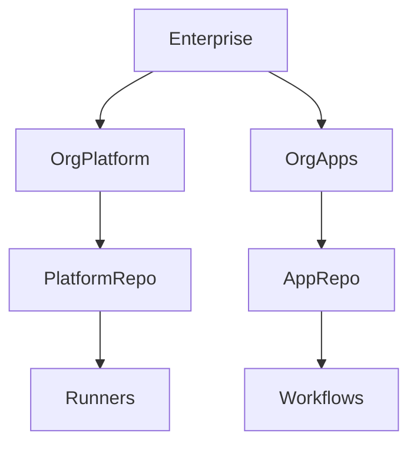
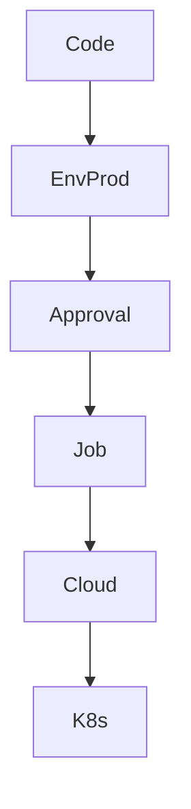

# Enterprise CI/CD Platform Project (Deep Dive)
## GitHub Actions + Permissions + Environments + OIDC + Kubernetes

This document represents **real production work** of a Senior Platform / DevOps Engineer.

---

## 1. High-Level Architecture



---

## 2. BEFORE OIDC – Secret-Based Authentication

### Legacy Deployment YAML

```yaml
name: deploy-legacy

on:
  push:
    branches: [ main ]

jobs:
  deploy:
    runs-on: self-hosted

    steps:
      - uses: actions/checkout@v4

      - name: Azure Login (Legacy)
        env:
          AZ_CLIENT_ID: ${{ secrets.AZ_CLIENT_ID }}
          AZ_CLIENT_SECRET: ${{ secrets.AZ_CLIENT_SECRET }}
          AZ_TENANT_ID: ${{ secrets.AZ_TENANT_ID }}
        run: |
          az login             --service-principal             -u $AZ_CLIENT_ID             -p $AZ_CLIENT_SECRET             --tenant $AZ_TENANT_ID

      - name: Deploy
        run: kubectl apply -f k8s/
```

Problems:
- Secrets stored in GitHub
- Long-lived credentials
- No environment boundary

---

## 3. AFTER OIDC – Identity-Based Authentication

### Required Permissions

```yaml
permissions:
  contents: read
  id-token: write
```

---

## 4. Platform Reusable Workflow (FULL)

```yaml
name: deploy-k8s

on:
  workflow_call:
    inputs:
      environment:
        required: true
        type: string

permissions:
  contents: read
  id-token: write

jobs:
  deploy:
    runs-on: self-hosted
    environment: ${{ inputs.environment }}

    steps:
      - uses: actions/checkout@v4

      - name: Login using OIDC
        uses: azure/login@v2
        with:
          client-id: ${{ vars.AZ_CLIENT_ID }}
          tenant-id: ${{ vars.AZ_TENANT_ID }}
          subscription-id: ${{ vars.AZ_SUBSCRIPTION_ID }}

      - name: Deploy to Kubernetes
        run: kubectl apply -f k8s/
```

---

## 5. Application Repo Workflow

```yaml
jobs:
  deploy:
    uses: org-platform/.github/workflows/deploy-k8s.yml@v1
    with:
      environment: prod
```

---

## 6. Environments and Approvals



---

## 7. Permissions Explained

- `contents: read` → allows checkout
- `id-token: write` → enables OIDC
- Job-level permissions can only reduce scope

---

## 8. Ownership

| Area | Owner |
|-----|------|
| IAM trust | Cloud Admin |
| Workflows | Platform |
| App YAML | Dev Team |

---

## Final Note

This setup removes secrets and enforces identity-based access.
