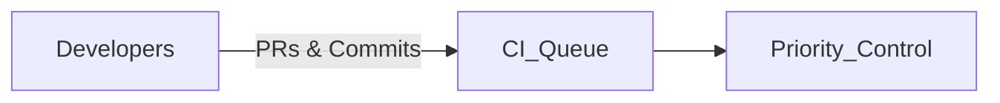
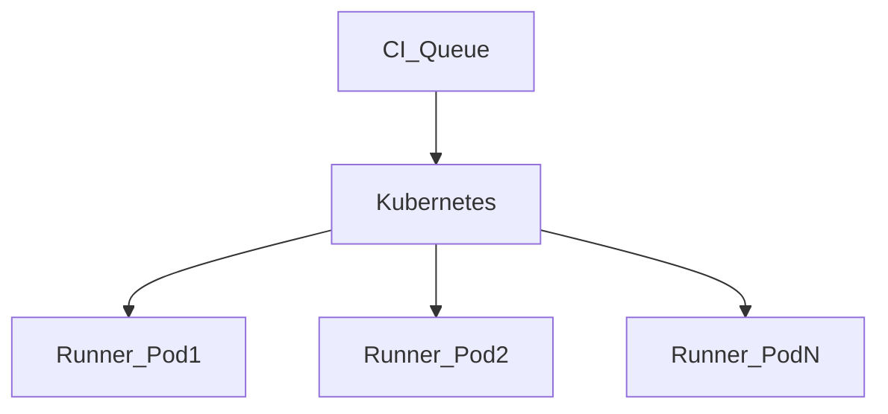
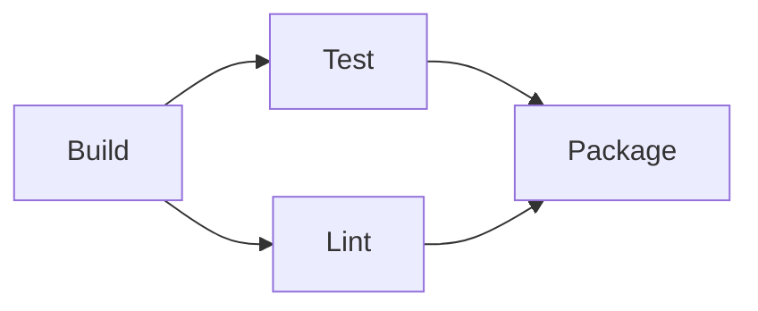
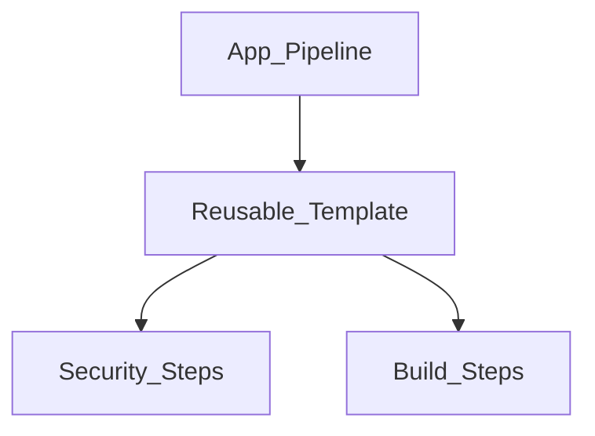
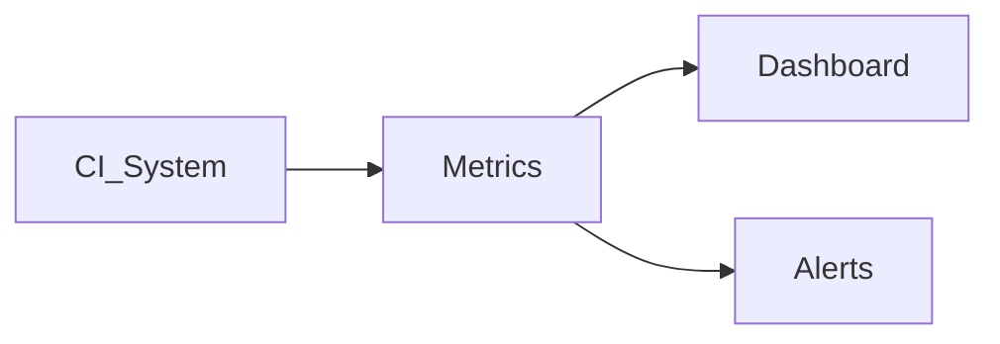
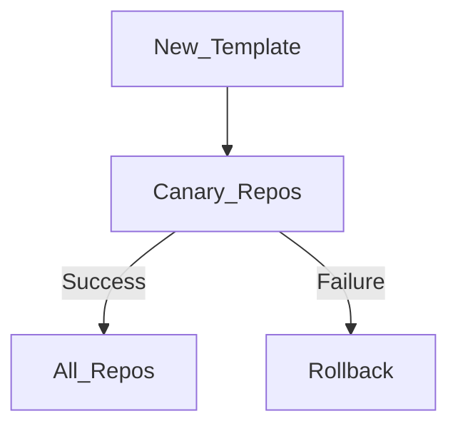
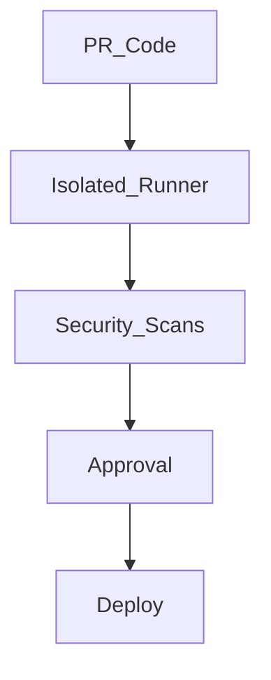
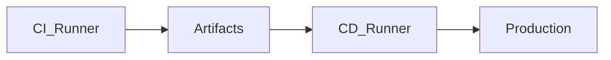

# CI/CD Scalability & Reliability – Enterprise Wiki

## Purpose
This wiki explains **how CI/CD platforms are designed to scale and remain reliable** in large enterprises (SAP-scale). CI/CD is treated as **production infrastructure**, not just pipelines.

---

## Mental Model (Very Important)

> **CI/CD is a factory**
>
> Developers place orders → CI/CD builds & delivers → Business depends on it

If CI/CD is slow, broken, or insecure → **delivery stops**.

---

## High-Level Layers (Memory Model)

```
Demand → Compute → Execution → Control → Observation → Recovery → Security
```

You can answer **any interview question** by mapping it to one of these layers.

---

## 1. Demand Layer (Scalability starts here)

### WHY this layer exists
As developer count increases, CI requests explode. Without control, CI collapses under load.

### WHAT this layer controls
- How many pipelines can start
- Which pipelines get priority

### HOW it is implemented
- Separate PR vs main pipelines
- Rate limiting per repo/team
- Priority for hotfix pipelines

### Diagram


### Failure if missing
- Long queues
- Developers bypass CI

---

## 2. Compute Layer (Where jobs actually run)

### WHY this layer exists
CI must scale horizontally, not vertically.

### WHAT it provides
- Runners (machines that execute jobs)

### HOW it is implemented
- Kubernetes-based ephemeral runners
- Auto-scale runners based on queue depth
- Separate runner pools (CI vs CD)

### Diagram


### Failure if missing
- Runner starvation
- High CI costs
- Security risks from shared runners

---

## 3. Execution Layer (How pipelines run)

### WHY this layer exists
Slow or wasteful pipelines destroy developer productivity.

### WHAT it optimizes
- Pipeline speed
- Resource usage

### HOW it is implemented
- Parallel stages
- Dependency & Docker layer caching
- Fail-fast logic

### Diagram


---

## 4. Control Layer (Governance & standards)

### WHY this layer exists
Without guardrails, teams skip security and quality steps.

### WHAT it enforces
- Mandatory pipeline stages
- Security and quality gates

### HOW it is implemented
- Reusable pipeline templates
- Branch protection rules
- Policy-as-code mindset

### Diagram


---

## 5. Observation Layer (Knowing CI/CD health)

### WHY this layer exists
You cannot fix what you cannot see.

### WHAT is observed
- Queue time
- Failure rate
- Runner utilization

### HOW it is implemented
- Metrics collection
- Dashboards
- Alerts for CI degradation

### Diagram


---

## 6. Recovery Layer (Handling failures safely)

### WHY this layer exists
Failures are inevitable; damage is optional.

### WHAT recovery means
- Fast rollback
- Failure isolation

### HOW it is implemented
- Versioned pipeline templates
- Canary rollout of CI changes
- Ability to pin older versions

### Diagram


---

## 7. Security Layer (Wraps everything)

### WHY this layer is critical
CI/CD has access to source code and production.

### WHAT is secured
- Secrets
- Runner isolation
- Supply chain

### HOW it is implemented
- No static secrets (OIDC)
- Ephemeral runners
- Mandatory security scans

### Diagram


---

## CI vs CD Separation (Best Practice)

### CI Runners
- Build & test only
- Language runtimes
- No production access

### CD Runners
- Deploy only
- kubectl / cloud CLI
- Strict access control

### Diagram


---

## Key Interview Summary (Memorize)

> Scalability keeps CI fast under load, reliability ensures failures recover safely, and security ensures CI/CD cannot be abused. This is achieved through auto-scaling runners, isolated execution, reusable standards, observability, controlled recovery, and identity-based security.

---

## One-Line Memory Formula

```
Fast under load → Survives failure → Safe by default
```

