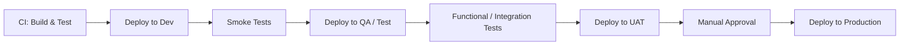

# Continuous Delivery (CD) & Continuous Deployment — Practical Wiki

This wiki builds **directly on CI**. If CI answers:

> "Is the integrated code technically correct?"

Then CD answers:

> "Is this code ready to run for users — safely and repeatedly?"

---

## 1. Why CD Came (The Gap After CI)

After CI was introduced, companies had:

- ✅ Clean builds
- ✅ Integrated code
- ❌ Manual, error‑prone deployments

Typical problems **after CI but before CD**:

- Manual copy of artifacts (WAR/JAR/Docker image)
- Different deployment steps per environment
- Missed scripts or wrong order of execution
- Configuration drift between environments

CI stopped bad code.

But **releases were still painful**.

That pain created **Continuous Delivery**.

---

## 2. What Continuous Delivery Really Means

**Continuous Delivery = Always releasable software**

In Continuous Delivery:

- Every successful CI build:
  - Is packaged
  - Is deployed automatically to lower environments
  - Passes smoke / sanity / basic acceptance tests

Production deployment:
- Is **manual approval**
- But deployment process is **fully automated**

Key idea:

> Release should be a business decision, not a technical challenge.

---

## 3. Continuous Deployment vs Continuous Delivery

| Aspect | Continuous Delivery | Continuous Deployment |
|-----|--------------------|----------------------|
| CI required | Yes | Yes |
| Deployment automated | Yes | Yes |
| Manual approval | Yes (prod) | No |
| Production deploy | Controlled | Automatic |
| Risk tolerance | Medium / High | Very High |

---

## 4. Why Many Companies Avoid Continuous Deployment

Industries like:
- Banking
- Healthcare
- Government
- Insurance

Avoid full Continuous Deployment because:

- Regulatory requirements
- Audit trails
- Risk of financial or patient impact

In these industries:

> "Speed is important, but correctness is critical"

So they use:

✔ Continuous Delivery
✔ Manual production approval
✔ Automated rollback strategies

---

## 5. Typical CD Pipeline Flow (Enterprise)

---

## 6. What CD Automates (Very Important)

CD automates:

- Artifact promotion (same build everywhere)
- Deployment scripts
- Environment‑specific configuration injection
- Service restarts / rollout strategies
- Smoke tests after deployment

CD eliminates:

- Manual SSH deployments
- Human memory‑based steps
- Environment drift

---

## 7. What CD Does NOT Guarantee

CD does **not**:

- Guarantee bug‑free software
- Replace monitoring
- Eliminate runtime failures

CD ensures:

> If deployment fails, it fails **predictably and recoverably**

---

## 8. Why Multiple Environments Exist

CI validates **build‑time integration**.

CD validates **runtime behavior**.

Different environments catch different problems:

| Environment | Purpose |
|-----------|--------|
| Dev | App starts, basic flow |
| QA / Test | Integration & regression |
| UAT | Business acceptance |
| Staging | Prod‑like behavior |
| Prod | Real users |

---

## 9. Key Difference Between CI and CD (Memory Lock)

- **CI** = Integration correctness
- **CD** = Runtime readiness

CI stops broken code.
CD stops broken releases.

---

## 10. One‑Sentence Memory Rules

- CI makes code **safe to release**
- CD makes releases **safe to run**

---

## 11. Interview‑Ready Definition

**Continuous Delivery** is the practice of automatically preparing, deploying, and validating every successful build across environments so that production release becomes a controlled, low‑risk decision.

**Continuous Deployment** is the extension where every validated change is deployed to production automatically.

---

## 12. Final Takeaway

CI answers:
> "Does it work together?"

CD answers:
> "Can we safely run it for users?"

Both are required for modern DevOps.

