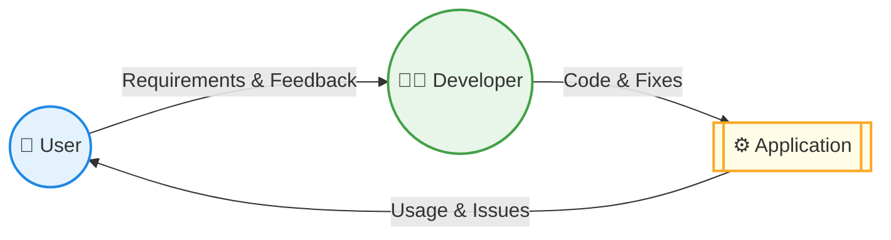

```mermaid
flowchart LR
    User((👤 User))
    Dev((👨‍💻 Developer))
    App[[⚙️ Application]]

    User -->|Requirements & Feedback| Dev
    Dev -->|Code & Fixes| App
    App -->|Usage & Issues| User

    style User fill:#E3F2FD,stroke:#1E88E5,stroke-width:2px
    style Dev fill:#E8F5E9,stroke:#43A047,stroke-width:2px
    style App fill:#FFFDE7,stroke:#F9A825,stroke-width:2px
```